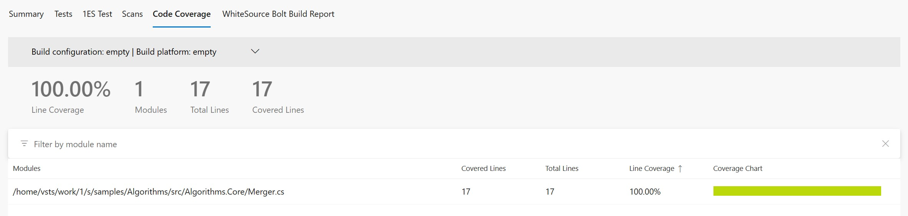
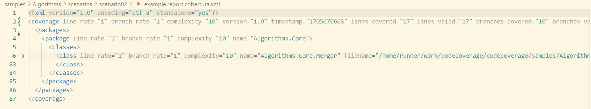

# Scenario Description

Collect code coverage using static instrumentation for MSTest runner project. As MSTest runner is console application which is performing static instrumentation it will fail on windows to instrument itself as file is locked. This is the reason why code coverage for test projects will be automatically excluded on Windows.

# Configuration

```xml
<?xml version="1.0" encoding="utf-8"?>
<Configuration>
    <CodeCoverage>
        <EnableDynamicManagedInstrumentation>False</EnableDynamicManagedInstrumentation>
        <EnableStaticManagedInstrumentation>True</EnableStaticManagedInstrumentation>
        <EnableStaticManagedInstrumentationRestore>False</EnableStaticManagedInstrumentationRestore>
    </CodeCoverage>
</Configuration>
```

# Collect code coverage using command line

```shell
git clone https://github.com/microsoft/codecoverage.git
cd codecoverage/samples/Algorithms/tests/Algorithms.Core.Tests/
dotnet run --ms-coverage --ms-coverage-output report.cobertura.xml --ms-coverage-output-format cobertura --ms-coverage-settings ../../scenarios/scenario02/coverage.config
```

You can also use [run.ps1](run.ps1) to collect code coverage.

# Collect code coverage inside github workflow

`reportgenerator` can be used to generate final github summary markdown.

```yml
    steps:
    - uses: actions/checkout@v3
    - name: Setup .NET
      uses: actions/setup-dotnet@v3
      with:
        dotnet-version: 8.0.x
    - name: Restore dependencies
      run: dotnet restore
    - name: Build
      run: dotnet build --no-restore
    - name: Test
      run: dotnet run --no-build --ms-coverage --ms-coverage-output $GITHUB_WORKSPACE/report.cobertura.xml --ms-coverage-output-format cobertura --ms-coverage-settings ../../scenarios/scenario02/coverage.config
    - name: ReportGenerator
      uses: danielpalme/ReportGenerator-GitHub-Action@5.2.0
      with:
        reports: '${{ github.workspace }}/report.cobertura.xml'
        targetdir: '${{ github.workspace }}/coveragereport'
        reporttypes: 'MarkdownSummaryGithub'
    - name: Upload coverage into summary
      run: cat $GITHUB_WORKSPACE/coveragereport/SummaryGithub.md >> $GITHUB_STEP_SUMMARY
    - name: Archive code coverage results
      uses: actions/upload-artifact@v3
      with:
        name: code-coverage-report
        path: ${{ github.workspace }}/report.cobertura.xml
```

[Full source example](../../../../.github/workflows/Algorithms_Scenario02.yml)

[Run example](../../../../../../actions/workflows/Algorithms_Scenario02.yml)

# Collect code coverage inside Azure DevOps Pipelines

```yml
steps:
- task: DotNetCoreCLI@2
  inputs:
    command: 'restore'
    projects: '$(projectPath)' # this is specific to example - in most cases not needed
  displayName: 'restore'

- task: DotNetCoreCLI@2
  inputs:
    command: 'build'
    arguments: '--no-restore --configuration $(buildConfiguration)'
    projects: '$(projectPath)' # this is specific to example - in most cases not needed
  displayName: 'build'

- task: DotNetCoreCLI@2
  inputs:
    command: 'run'
    arguments: '--no-build --configuration $(buildConfiguration) --results-directory $(Agent.TempDirectory) --ms-coverage --ms-coverage-output $(Agent.TempDirectory)/report.cobertura.xml --ms-coverage-output-format cobertura --report-trx'
    projects: '$(projectPath)' # this is specific to example - in most cases not needed
  displayName: 'test'

- task: PublishTestResults@2
  inputs:
    testResultsFormat: 'VSTest'
    testResultsFiles: '$(Agent.TempDirectory)/**/*.trx'
    publishRunAttachments: false

- task: PublishCodeCoverageResults@2
  inputs:
    summaryFileLocation: $(Agent.TempDirectory)/**/*.cobertura.xml
```

[Full source example](azure-pipelines.yml)



# Report example



[Link](example.report.cobertura.xml)