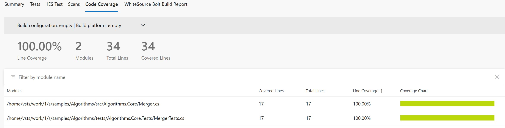
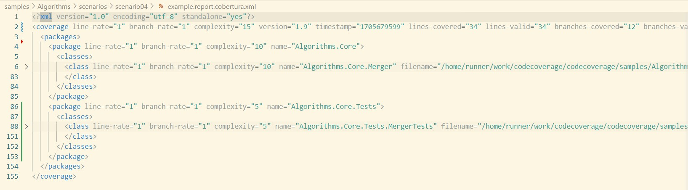

# Scenario Description

Collect code coverage using `dotnet-coverage` tool for MSTest runner project.

> **_NOTE:_** MSTest runner project coverage extension by default is not collecting native code coverage. If you want to enable please set to `True` `EnableStaticNativeInstrumentation` or `EnableDynamicNativeInstrumentation` in configuration.

## Collect code coverage using command line

```shell
git clone https://github.com/microsoft/codecoverage.git
cd codecoverage/samples/Algorithms/tests/Algorithms.Core.Tests/
dotnet build
dotnet tool install -g dotnet-coverage
dotnet-coverage collect --output report.cobertura.xml --output-format cobertura "dotnet run --no-build"
```

You can also use [run.ps1](run.ps1) to collect code coverage.

## Collect code coverage inside github workflow

`reportgenerator` can be used to generate final github summary markdown.

```yml
    steps:
    - uses: actions/checkout@v3
    - name: Setup .NET
      uses: actions/setup-dotnet@v3
      with:
        dotnet-version: 8.0.x
    - name: Restore dependencies
      run: dotnet restore
    - name: Build
      run: dotnet build --no-restore
    - name: Install dotnet-coverage
      run: dotnet tool install -g dotnet-coverage
    - name: Test
      run: dotnet-coverage collect --output $GITHUB_WORKSPACE/report.cobertura.xml --output-format cobertura "dotnet run --no-build"
    - name: ReportGenerator
      uses: danielpalme/ReportGenerator-GitHub-Action@5.2.0
      with:
        reports: '${{ github.workspace }}/report.cobertura.xml'
        targetdir: '${{ github.workspace }}/coveragereport'
        reporttypes: 'MarkdownSummaryGithub'
    - name: Upload coverage into summary
      run: cat $GITHUB_WORKSPACE/coveragereport/SummaryGithub.md >> $GITHUB_STEP_SUMMARY
    - name: Archive code coverage results
      uses: actions/upload-artifact@v3
      with:
        name: code-coverage-report
        path: ${{ github.workspace }}/report.cobertura.xml
```

[Full source example](../../../../.github/workflows/Algorithms_Scenario04.yml)

[Run example](../../../../../../actions/workflows/Algorithms_Scenario04.yml)

## Collect code coverage inside Azure DevOps Pipelines

```yml
steps:
- task: DotNetCoreCLI@2
  inputs:
    command: 'restore'
    projects: '$(projectPath)' # this is specific to example - in most cases not needed
  displayName: 'restore'

- task: DotNetCoreCLI@2
  inputs:
    command: 'build'
    arguments: '--no-restore --configuration $(buildConfiguration)'
    projects: '$(projectPath)' # this is specific to example - in most cases not needed
  displayName: 'build'

- task: DotNetCoreCLI@2
  inputs:
    command: 'custom'
    custom: "tool"
    arguments: 'install -g dotnet-coverage'
  displayName: 'install dotnet-coverage'

- task: Bash@3
  inputs:
    targetType: 'inline'
    script: 'dotnet-coverage collect --output-format cobertura --output $(Agent.TempDirectory)/report.cobertura.xml "dotnet run --project $(projectPath) --no-build --report-trx --configuration $(buildConfiguration) --results-directory $(Agent.TempDirectory)"'
  displayName: 'test'

- task: PublishTestResults@2
  inputs:
    testResultsFormat: 'VSTest'
    testResultsFiles: '$(Agent.TempDirectory)/**/*.trx'
    publishRunAttachments: false

- task: PublishCodeCoverageResults@2
  inputs:
    summaryFileLocation: $(Agent.TempDirectory)/**/*.cobertura.xml
```

[Full source example](azure-pipelines.yml)



## Report example



[Link](example.report.cobertura.xml)
