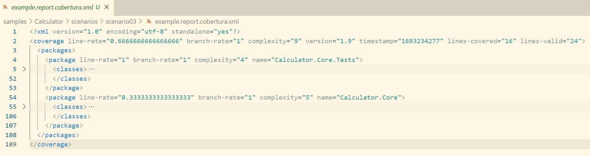

# Scenario Description

Collect code coverage using cobertura report format by specifying configuration. Cobertura report format can be used to generate HTML report using [report generator](https://github.com/danielpalme/ReportGenerator). This format can be also used with [PublishCodeCoverageResults@2](https://learn.microsoft.com/en-us/azure/devops/pipelines/tasks/reference/publish-code-coverage-results-v2?view=azure-pipelines) in Azure DevOps pipelines.

# Collect code coverage using command line

```shell
git clone https://github.com/microsoft/codecoverage.git
cd codecoverage/samples/Calculator/tests/Calculator.Core.Tests/
dotnet test --settings ../../scenarios/scenario03/coverage.runsettings
```

> **_NOTE:_** You don't have to use `--collect "Code Coverage"` when you specify runsettings with code coverage configuration.

You can also use [run.ps1](run.ps1) to collect code coverage.

# Collect code coverage inside github workflow

```shell
    steps:
    - uses: actions/checkout@v3
    - name: Setup .NET
      uses: actions/setup-dotnet@v3
      with:
        dotnet-version: 7.0.x
    - name: Restore dependencies
      run: dotnet restore
    - name: Build
      run: dotnet build --no-restore
    - name: Test
      run: dotnet test --settings ../../scenarios/scenario03/coverage.runsettings --no-build --verbosity normal
    - name: Archive code coverage results
      uses: actions/upload-artifact@v3
      with:
        name: code-coverage-report
        path: ./**/TestResults/**/*.cobertura.xml
```

[Full source example](../../../../.github/workflows/Calculator_Scenario03.yml)

[Run example](../../../../../../actions/workflows/Calculator_Scenario03.yml)

# Report example



[Link](example.report.cobertura.xml)