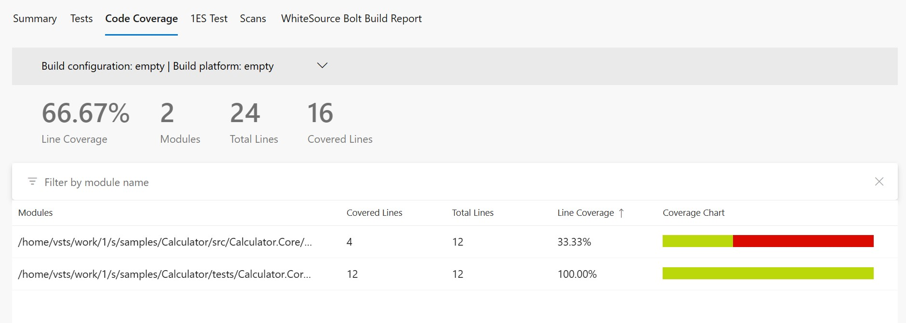
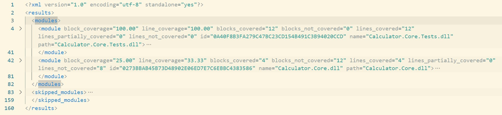

# Scenario Description

Collect code coverage with XML report format.

# Collect code coverage using command line

```shell
git clone https://github.com/microsoft/codecoverage.git
cd codecoverage/samples/Calculator/tests/Calculator.Core.Tests/
dotnet test --collect "Code Coverage;Format=xml"
```

You can also use [run.ps1](run.ps1) to collect code coverage.

# Collect code coverage inside github workflow

```yml
    steps:
    - uses: actions/checkout@v3
    - name: Setup .NET
      uses: actions/setup-dotnet@v3
      with:
        dotnet-version: 7.0.x
    - name: Restore dependencies
      run: dotnet restore
    - name: Build
      run: dotnet build --no-restore
    - name: Test
      run: dotnet test --collect "Code Coverage;Format=xml" --no-build --verbosity normal
    - name: ReportGenerator
      uses: danielpalme/ReportGenerator-GitHub-Action@5.2.0
      with:
        reports: './**/TestResults/**/*.xml'
        targetdir: '${{ github.workspace }}/coveragereport'
        reporttypes: 'MarkdownSummaryGithub'
    - name: Upload coverage into summary
      run: cat $GITHUB_WORKSPACE/coveragereport/SummaryGithub.md >> $GITHUB_STEP_SUMMARY
    - name: Upload raw coverage report artifact
      uses: actions/upload-artifact@v3
      with:
        name: RawCoverageReport
        path: ./**/TestResults/**/*.xml
```

[Full source example](../../../../.github/workflows/Calculator_Scenario04.yml)

[Run example](../../../../../../actions/workflows/Calculator_Scenario04.yml)

# Collect code coverage inside Azure DevOps Pipelines

```yml
steps:
- task: DotNetCoreCLI@2
  inputs:
    command: 'restore'
    projects: '$(projectPath)' # this is specific to example - in most cases not needed
  displayName: 'dotnet restore'

- task: DotNetCoreCLI@2
  inputs:
    command: 'build'
    arguments: '--no-restore --configuration $(buildConfiguration)'
    projects: '$(projectPath)' # this is specific to example - in most cases not needed
  displayName: 'dotnet build'

- task: DotNetCoreCLI@2
  inputs:
    command: 'test'
    arguments: '--no-build --configuration $(buildConfiguration) --collect "Code Coverage;Format=xml" --logger trx --results-directory $(Agent.TempDirectory)/TestResults'
    publishTestResults: false
    projects: '$(projectPath)' # this is specific to example - in most cases not needed
  displayName: 'dotnet test'

- task: PublishTestResults@2
  inputs:
    testResultsFormat: 'VSTest'
    testResultsFiles: '$(Agent.TempDirectory)/TestResults/**/*.trx'
    publishRunAttachments: false

- task: PublishCodeCoverageResults@2
  inputs:
    summaryFileLocation: $(Agent.TempDirectory)/TestResults/**/*.xml
```

> **_NOTE:_** To make sure that Code Coverage tab will be visible in Azure DevOps you need to make sure that previous steps will not publish test attachments (`publishRunAttachments: false` and `publishTestResults: false`).

[Full source example](azure-pipelines.yml)



# Report example



[Link](example.report.xml)
