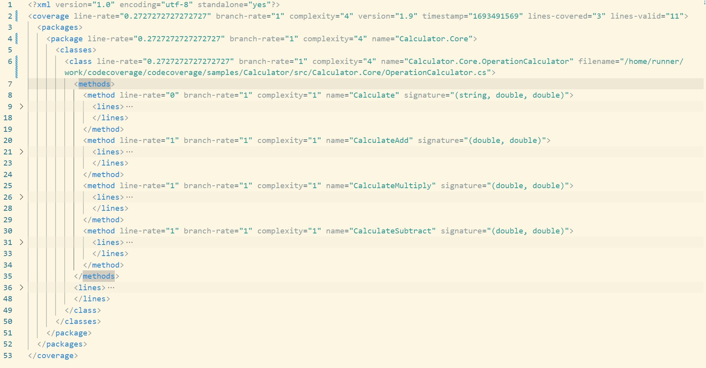

# Scenario Description

In this example we want to show you how to exclude from code coverage report whole project (tests project), method (`CalculateDivide`) and source file (`OperationConsts.cs`). We are also using cobertura report format by specifying configuration. Cobertura report format can be used to generate HTML report using [report generator](https://github.com/danielpalme/ReportGenerator). This format can be also used with [PublishCodeCoverageResults@2](https://learn.microsoft.com/en-us/azure/devops/pipelines/tasks/reference/publish-code-coverage-results-v2?view=azure-pipelines) in Azure DevOps pipelines.

## Configuration

```xml
<?xml version="1.0" encoding="utf-8"?>
<RunSettings>
  <DataCollectionRunSettings>
    <DataCollectors>
      <DataCollector friendlyName="Code Coverage" uri="datacollector://Microsoft/CodeCoverage/2.0" assemblyQualifiedName="Microsoft.VisualStudio.Coverage.DynamicCoverageDataCollector, Microsoft.VisualStudio.TraceCollector, Version=11.0.0.0, Culture=neutral, PublicKeyToken=b03f5f7f11d50a3a">
        <Configuration>
          <Format>cobertura</Format>
          <CodeCoverage>
            <ModulePaths>
              <Exclude>
                <ModulePath>.*tests.dll$</ModulePath>
              </Exclude>
            </ModulePaths>
            <Functions>
              <Exclude>
                <Function>.*OperationCalculator\.CalculateDivide.*</Function>
              </Exclude>
            </Functions>
            <Sources>
              <Exclude>
                <Source>.*OperationConsts\.cs$</Source>
              </Exclude>
            </Sources>
            <UseVerifiableInstrumentation>False</UseVerifiableInstrumentation>
            <EnableStaticNativeInstrumentation>False</EnableStaticNativeInstrumentation>
            <EnableDynamicNativeInstrumentation>False</EnableDynamicNativeInstrumentation>
          </CodeCoverage>
        </Configuration>
      </DataCollector>
    </DataCollectors>
  </DataCollectionRunSettings>
</RunSettings>
```

> **_NOTE:_** Remember that any regex used for `<ModulePath>` or `<Source>` is matched for file path not file name.

## Collect code coverage using command line

```shell
git clone https://github.com/microsoft/codecoverage.git
cd codecoverage/samples/Calculator/tests/Calculator.Core.Tests/
dotnet test --settings ../../scenarios/scenario05/coverage.runsettings
```

> **_NOTE:_** You don't have to use `--collect "Code Coverage"` when you specify runsettings with code coverage configuration.

You can also use [run.ps1](run.ps1) to collect code coverage.

## Collect code coverage inside github workflow

```yml
    steps:
    - uses: actions/checkout@v3
    - name: Setup .NET
      uses: actions/setup-dotnet@v3
      with:
        dotnet-version: 8.0.x
    - name: Restore dependencies
      run: dotnet restore
    - name: Build
      run: dotnet build --no-restore
    - name: Test
      run: dotnet test --settings ../../scenarios/scenario05/coverage.runsettings --no-build --verbosity normal
    - name: ReportGenerator
      uses: danielpalme/ReportGenerator-GitHub-Action@5.2.0
      with:
        reports: './**/TestResults/**/*.cobertura.xml'
        targetdir: '${{ github.workspace }}/coveragereport'
        reporttypes: 'MarkdownSummaryGithub'
    - name: Upload coverage into summary
      run: cat $GITHUB_WORKSPACE/coveragereport/SummaryGithub.md >> $GITHUB_STEP_SUMMARY
    - name: Archive code coverage results
      uses: actions/upload-artifact@v4
      with:
        name: code-coverage-report
        path: ./**/TestResults/**/*.cobertura.xml
        overwrite: true
```

[Full source example](../../../../.github/workflows/Calculator_Scenario05.yml)

[Run example](../../../../../../actions/workflows/Calculator_Scenario05.yml)

## Collect code coverage inside Azure DevOps Pipelines

```yml
steps:
- task: DotNetCoreCLI@2
  inputs:
    command: 'restore'
    projects: '$(projectPath)' # this is specific to example - in most cases not needed
  displayName: 'dotnet restore'

- task: DotNetCoreCLI@2
  inputs:
    command: 'build'
    arguments: '--no-restore --configuration $(buildConfiguration)'
    projects: '$(projectPath)' # this is specific to example - in most cases not needed
  displayName: 'dotnet build'

- task: DotNetCoreCLI@2
  inputs:
    command: 'test'
    arguments: '--no-build --configuration $(buildConfiguration) --settings samples/Calculator/scenarios/scenario05/coverage.runsettings --logger trx --results-directory $(Agent.TempDirectory)'
    publishTestResults: false
    projects: '$(projectPath)' # this is specific to example - in most cases not needed
  displayName: 'dotnet test'

- task: PublishTestResults@2
  inputs:
    testResultsFormat: 'VSTest'
    testResultsFiles: '$(Agent.TempDirectory)/**/*.trx'
    publishRunAttachments: false

- task: PublishCodeCoverageResults@2
  inputs:
    summaryFileLocation: $(Agent.TempDirectory)/**/*.cobertura.xml
```

> **_NOTE:_** To make sure that Code Coverage tab will be visible in Azure DevOps you need to make sure that previous steps will not publish test attachments (`publishRunAttachments: false` and `publishTestResults: false`).

[Full source example](azure-pipelines.yml)


## Report example



[Link](example.report.cobertura.xml)
