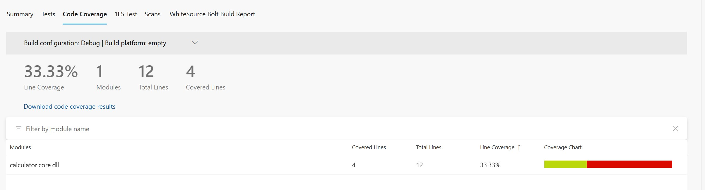
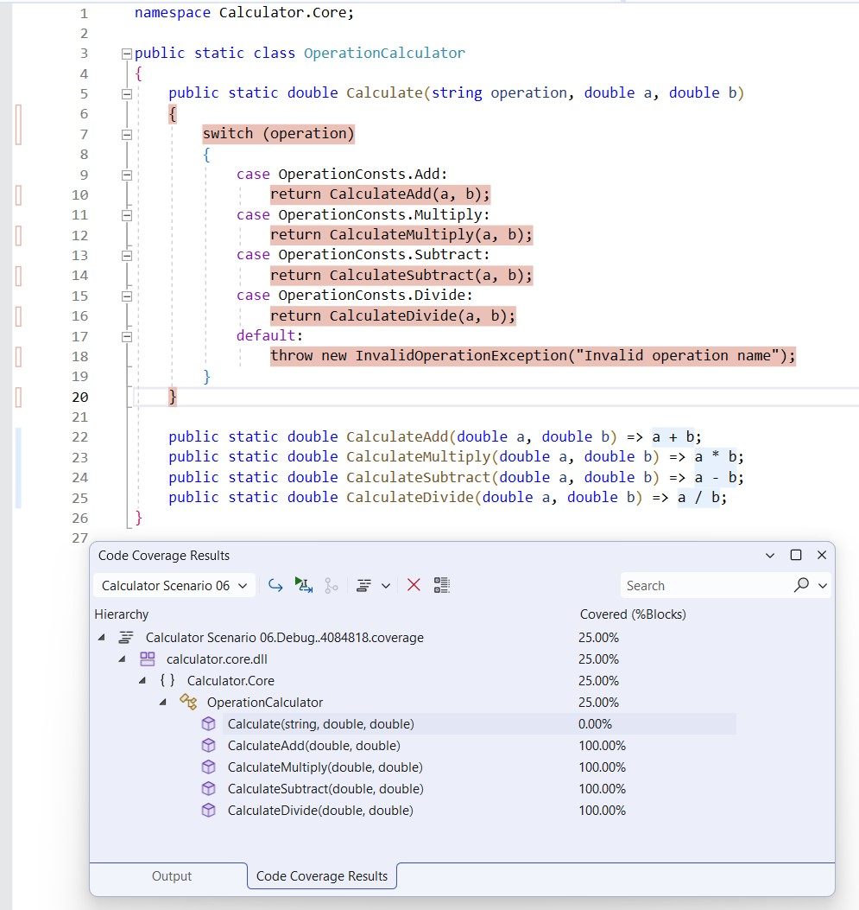

# Scenario Description

In this example we want to show you how to exclude from code coverage tests projects and any other libraries (moq, xunit). Regex `.*calculator[^/\\]*\.dll$` makes sure that only libraries containing `calculator` in file name are matched. If path is matched by one of the `<Include>` regexes and one of the `<Exclude>` regexes then finally path is excluded. Checking that after `calculator` string there is no `\` or '/' makes sure that path `D:\calculator\moq.dll` is not matched. Default format is binary (`.coverage` extension) which can be opened in Visual Studio Enterprise.

## Configuration

```xml
<?xml version="1.0" encoding="utf-8"?>
<RunSettings>
  <DataCollectionRunSettings>
    <DataCollectors>
      <DataCollector friendlyName="Code Coverage" uri="datacollector://Microsoft/CodeCoverage/2.0" assemblyQualifiedName="Microsoft.VisualStudio.Coverage.DynamicCoverageDataCollector, Microsoft.VisualStudio.TraceCollector, Version=11.0.0.0, Culture=neutral, PublicKeyToken=b03f5f7f11d50a3a">
        <Configuration>
          <CodeCoverage>
            <ModulePaths>
              <Include>
                <ModulePath>.*calculator[^/\\]*\.dll$</ModulePath>
              </Include>
              <Exclude>
                <ModulePath>.*tests.dll$</ModulePath>
              </Exclude>
            </ModulePaths>
            <UseVerifiableInstrumentation>False</UseVerifiableInstrumentation>
            <EnableStaticNativeInstrumentation>False</EnableStaticNativeInstrumentation>
            <EnableDynamicNativeInstrumentation>False</EnableDynamicNativeInstrumentation>
          </CodeCoverage>
        </Configuration>
      </DataCollector>
    </DataCollectors>
  </DataCollectionRunSettings>
</RunSettings>
```

> **_NOTE:_** Remember that any regex used for `<ModulePath>` or `<Source>` is matched for file path not file name.

## Collect code coverage using command line

```shell
git clone https://github.com/microsoft/codecoverage.git
cd codecoverage/samples/Calculator/tests/Calculator.Core.Tests/
dotnet test --settings ../../scenarios/scenario06/coverage.runsettings
```

> **_NOTE:_** You don't have to use `--collect "Code Coverage"` when you specify runsettings with code coverage configuration.

You can also use [run.ps1](run.ps1) to collect code coverage.

## Collect code coverage inside github workflow

```yml
    steps:
    - uses: actions/checkout@v3
    - name: Setup .NET
      uses: actions/setup-dotnet@v3
      with:
        dotnet-version: 8.0.x
    - name: Restore dependencies
      run: dotnet restore
    - name: Build
      run: dotnet build --no-restore
    - name: Test
      run: dotnet test --settings ../../scenarios/scenario06/coverage.runsettings --no-build --verbosity normal
    - name: Install dotnet-coverage
      run: dotnet tool install -g dotnet-coverage
    - name: Convert .coverage report to cobertura
      run: dotnet-coverage merge $GITHUB_WORKSPACE/samples/Calculator/tests/Calculator.Core.Tests/TestResults/**/*.coverage -f cobertura -o $GITHUB_WORKSPACE/report.cobertura.xml
    - name: ReportGenerator
      uses: danielpalme/ReportGenerator-GitHub-Action@5.2.0
      with:
        reports: '${{ github.workspace }}/report.cobertura.xml'
        targetdir: '${{ github.workspace }}/coveragereport'
        reporttypes: 'MarkdownSummaryGithub'
    - name: Upload coverage into summary
      run: cat $GITHUB_WORKSPACE/coveragereport/SummaryGithub.md >> $GITHUB_STEP_SUMMARY
    - name: Archive code coverage results
      uses: actions/upload-artifact@v3
      with:
        name: code-coverage-report
        path: ./**/TestResults/**/*.coverage
```

[Full source example](../../../../.github/workflows/Calculator_Scenario06.yml)

[Run example](../../../../../../actions/workflows/Calculator_Scenario06.yml)

## Collect code coverage inside Azure DevOps Pipelines

```yml
steps:
- task: DotNetCoreCLI@2
  inputs:
    command: 'restore'
    projects: '$(projectPath)' # this is specific to example - in most cases not needed
  displayName: 'dotnet restore'

- task: DotNetCoreCLI@2
  inputs:
    command: 'build'
    arguments: '--no-restore --configuration $(buildConfiguration)'
    projects: '$(projectPath)' # this is specific to example - in most cases not needed
  displayName: 'dotnet build'

- task: DotNetCoreCLI@2
  inputs:
    command: 'test'
    arguments: '--no-build --configuration $(buildConfiguration) --settings samples/Calculator/scenarios/scenario06/coverage.runsettings'
    projects: '$(projectPath)' # this is specific to example - in most cases not needed
  displayName: 'dotnet test'
```

> **_NOTE:_** Azure DevOps pipelines automatically recognize binary coverage report format. Code coverage results are automatically processed and published to Azure DevOps. No additional steps needed.

[Full source example](azure-pipelines.yml)



## Report example



[Link](example.report.coverage)
