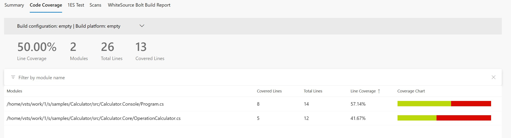
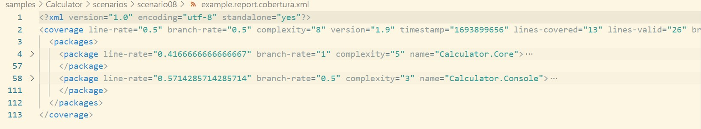

# Scenario Description

This example shows how our tool [dotnet-coverage](https://aka.ms/dotnet-coverage) can be used to collect code coverage for console application. Cobertura report format can be used to generate HTML report using [report generator](https://github.com/danielpalme/ReportGenerator). This format can be also used with [PublishCodeCoverageResults@2](https://learn.microsoft.com/en-us/azure/devops/pipelines/tasks/reference/publish-code-coverage-results-v2?view=azure-pipelines) in Azure DevOps pipelines.

## Collect code coverage using command line

```shell
git clone https://github.com/microsoft/codecoverage.git
cd codecoverage/samples/Calculator/src/Calculator.Console/
dotnet build
dotnet tool install -g dotnet-coverage
dotnet-coverage collect -f cobertura "dotnet run --no-build add 10 24"
```

You can also use [run.ps1](run.ps1) to execute this scenario.

## Collect code coverage inside github workflow

```yml
    steps:
    - uses: actions/checkout@v4
    - name: Setup .NET
      uses: actions/setup-dotnet@v4
      with:
        dotnet-version: 8.0.x
    - name: Restore dependencies
      run: dotnet restore
    - name: Build
      run: dotnet build --no-restore
    - name: Install dotnet-coverage
      run: dotnet tool install -g dotnet-coverage
    - name: Run
      run: dotnet-coverage collect -f cobertura -o $GITHUB_WORKSPACE/report.cobertura.xml "dotnet run --no-build add 10 24"
    - name: ReportGenerator
      uses: danielpalme/ReportGenerator-GitHub-Action@5.2.0
      with:
        reports: '${{ github.workspace }}/report.cobertura.xml'
        targetdir: '${{ github.workspace }}/coveragereport'
        reporttypes: 'MarkdownSummaryGithub'
    - name: Upload coverage into summary
      run: cat $GITHUB_WORKSPACE/coveragereport/SummaryGithub.md >> $GITHUB_STEP_SUMMARY
    - name: Archive code coverage results
      uses: actions/upload-artifact@v4
      with:
        name: code-coverage-report
        path: '${{ github.workspace }}/report.cobertura.xml'
        overwrite: true
```

[Full source example](../../../../.github/workflows/Calculator_Scenario08.yml)

[Run example](../../../../../../actions/workflows/Calculator_Scenario08.yml)

## Collect code coverage inside Azure DevOps Pipelines

```yml
steps:
- task: DotNetCoreCLI@2
  inputs:
    command: 'restore'
    projects: '$(projectPath)' # this is specific to example - in most cases not needed
  displayName: 'dotnet restore'

- task: DotNetCoreCLI@2
  inputs:
    command: 'build'
    arguments: '--no-restore --configuration $(buildConfiguration)'
    projects: '$(projectPath)' # this is specific to example - in most cases not needed
  displayName: 'dotnet build'

- task: DotNetCoreCLI@2
  inputs:
    command: 'custom'
    custom: "tool"
    arguments: 'install -g dotnet-coverage'
  displayName: 'install dotnet-coverage'

- task: Bash@3
  inputs:
    targetType: 'inline'
    script: 'dotnet-coverage collect -f cobertura -o report.cobertura.xml "dotnet run --project $(projectPath) --no-build add 10 24"'
  displayName: 'dotnet run'

- task: PublishCodeCoverageResults@2
  inputs:
    summaryFileLocation: '$(Build.SourcesDirectory)/report.cobertura.xml'
```

[Full source example](azure-pipelines.yml)



## Report example



[Link](example.report.cobertura.xml)
