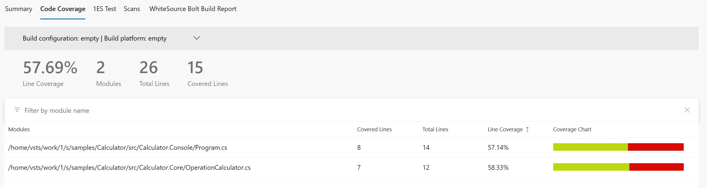
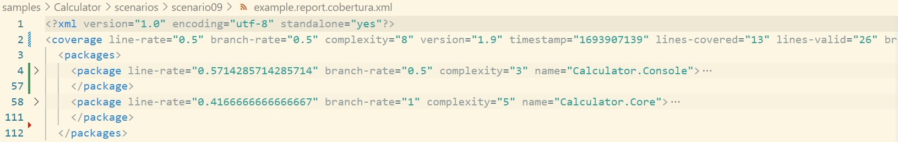

# Scenario Description

This example shows how our tool [dotnet-coverage](https://aka.ms/dotnet-coverage) can be used to collect code coverage for console application using [static instrumentation](../../../../docs/instrumentation.md). `dotnet-coverage` `instrument` command is used to instrument files and code coverage session is started in background. Similar sequence can be used for more advanced scenarios - for example IIS. When executing tests this is not needed as our tooling automatically detects directory with libraries and instrument it. Cobertura report format can be used to generate HTML report using [report generator](https://github.com/danielpalme/ReportGenerator). This format can be also used with [PublishCodeCoverageResults@2](https://learn.microsoft.com/en-us/azure/devops/pipelines/tasks/reference/publish-code-coverage-results-v2?view=azure-pipelines) in Azure DevOps pipelines.

# Collect code coverage using command line

```shell
git clone https://github.com/microsoft/codecoverage.git
cd codecoverage/samples/Calculator/src/Calculator.Console/
dotnet build
dotnet tool install -g dotnet-coverage
dotnet-coverage instrument --session-id TagScenario10 "./bin/Debug/net7.0/Calculator.Core.dll"
dotnet-coverage instrument --session-id TagScenario10 "./bin/Debug/net7.0/Calculator.Console.dll"
dotnet-coverage collect --session-id TagScenario10 --server-mode --background -f cobertura
dotnet run --no-build add 10 24
dotnet run --no-build multiply 10 24
dotnet-coverage shutdown TagScenario10
```

You can also use [run.ps1](run.ps1) to execute this scenario.

# Collect code coverage inside github workflow

```yml
    steps:
    - uses: actions/checkout@v3
    - name: Setup .NET
      uses: actions/setup-dotnet@v3
      with:
        dotnet-version: 7.0.x
    - name: Restore dependencies
      run: dotnet restore
    - name: Build
      run: dotnet build --no-restore
    - name: Install dotnet-coverage
      run: dotnet tool install -g dotnet-coverage
    - name: Instrument Calculator.Core.dll
      run: dotnet-coverage instrument --session-id TagScenario10 "./bin/Debug/net7.0/Calculator.Core.dll"
    - name: Instrument Calculator.Console.dll
      run: dotnet-coverage instrument --session-id TagScenario10 "./bin/Debug/net7.0/Calculator.Console.dll"
    - name: Start code coverage collection session
      run: dotnet-coverage collect --session-id TagScenario10 --server-mode --background -f cobertura -o $GITHUB_WORKSPACE/report.cobertura.xml
    - name: Run (add)
      run: dotnet run --no-build add 10 24
    - name: Run (multiply)
      run: dotnet run --no-build multiply 10 24
    - name: Stop code coverage collection session
      run: dotnet-coverage shutdown TagScenario10
    - name: ReportGenerator
      uses: danielpalme/ReportGenerator-GitHub-Action@5.2.0
      with:
        reports: '${{ github.workspace }}/report.cobertura.xml'
        targetdir: '${{ github.workspace }}/coveragereport'
        reporttypes: 'MarkdownSummaryGithub'
    - name: Upload coverage into summary
      run: cat $GITHUB_WORKSPACE/coveragereport/SummaryGithub.md >> $GITHUB_STEP_SUMMARY
    - name: Archive code coverage results
      uses: actions/upload-artifact@v3
      with:
        name: code-coverage-report
        path: '${{ github.workspace }}/report.cobertura.xml'
```

[Full source example](../../../../.github/workflows/Calculator_Scenario10.yml)

[Run example](../../../../../../actions/workflows/Calculator_Scenario10.yml)

# Collect code coverage inside Azure DevOps Pipelines

```yml
steps:
- task: DotNetCoreCLI@2
  inputs:
    command: 'restore'
    projects: '$(projectPath)' # this is specific to example - in most cases not needed
  displayName: 'dotnet restore'

- task: DotNetCoreCLI@2
  inputs:
    command: 'build'
    arguments: '--no-restore --configuration $(buildConfiguration)'
    projects: '$(projectPath)' # this is specific to example - in most cases not needed
  displayName: 'dotnet build'

- task: DotNetCoreCLI@2
  inputs:
    command: 'custom'
    custom: "tool"
    arguments: 'install -g dotnet-coverage'
  displayName: 'install dotnet-coverage'

- task: Bash@3
  inputs:
    targetType: 'inline'
    script: 'dotnet-coverage instrument --session-id TagScenario10 "$(Build.SourcesDirectory)/samples/Calculator/src/Calculator.Console/bin/Debug/net7.0/Calculator.Core.dll"'
  displayName: 'Instrument Calculator.Core.dll'

- task: Bash@3
  inputs:
    targetType: 'inline'
    script: 'dotnet-coverage instrument --session-id TagScenario10 "$(Build.SourcesDirectory)/samples/Calculator/src/Calculator.Console/bin/Debug/net7.0/Calculator.Console.dll"'
  displayName: 'Instrument Calculator.Console.dll'

- task: Bash@3
  inputs:
    targetType: 'inline'
    script: 'dotnet-coverage collect --session-id TagScenario10 --server-mode --background -f cobertura -o report.cobertura.xml'
  displayName: 'Start code coverage collection session'

- task: DotNetCoreCLI@2
  inputs:
    command: 'run'
    arguments: '--no-build --configuration $(buildConfiguration) add 10 24'
    projects: '$(projectPath)' # this is specific to example - in most cases not needed
  displayName: 'dotnet run (add)'

- task: DotNetCoreCLI@2
  inputs:
    command: 'run'
    arguments: '--no-build --configuration $(buildConfiguration) multiply 10 24'
    projects: '$(projectPath)' # this is specific to example - in most cases not needed
  displayName: 'dotnet run (multiply)'

- task: Bash@3
  inputs:
    targetType: 'inline'
    script: 'dotnet-coverage shutdown TagScenario10'
  displayName: 'Stop code coverage collection session'

- task: PublishCodeCoverageResults@2
  inputs:
    summaryFileLocation: '$(Build.SourcesDirectory)/report.cobertura.xml'
```

[Full source example](azure-pipelines.yml)



# Report example



[Link](example.report.cobertura.xml)