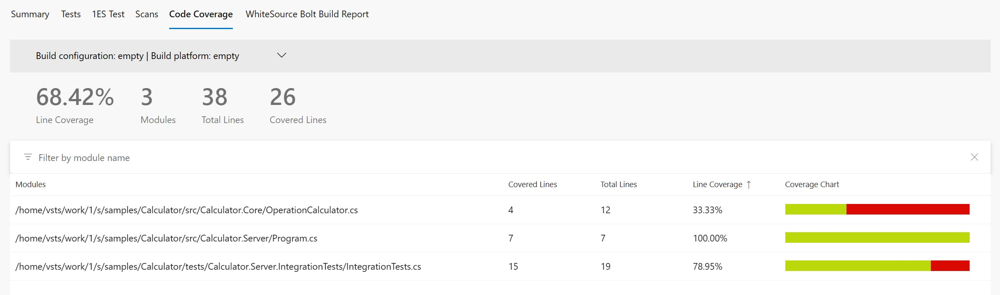
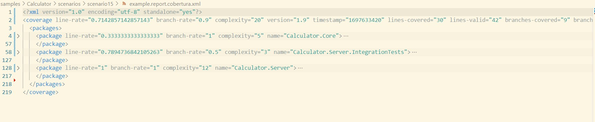

# Scenario Description

Collect code coverage for ASP.NET Core integration tests. You can find here example how to collect coverage for server and tests if they are running in separate processes and server is started before tests execution. `dotnet-coverage` tool in server mode is used to collect code coverage for server and tests. `connect`  command is used to attach server and tests processes into coverage collection.

## Collect code coverage using command line

```shell
git clone https://github.com/microsoft/codecoverage.git
cd codecoverage/samples/Calculator
dotnet build
dotnet tool install -g dotnet-coverage
dotnet-coverage collect --output-format cobertura --output report.cobertura.xml --session-id TagScenario15 --background --server-mode
cd src/Calculator.Server
dotnet-coverage connect --background TagScenario15 "dotnet run --no-build"
cd ../../tests/Calculator.Server.IntegrationTests
dotnet-coverage connect TagScenario15 "dotnet test --no-build"
dotnet-coverage shutdown TagScenario15
```

You can also use [run.ps1](run.ps1) to collect code coverage.

## Collect code coverage inside github workflow

To generate summary report `.coverage` report needs to be converted to `cobertura` report using `dotnet-coverage` tool. Then `reportgenerator` can be used to generate final github summary markdown.

```yml
    steps:
    - uses: actions/checkout@v3
    - name: Setup .NET
      uses: actions/setup-dotnet@v3
      with:
        dotnet-version: 8.0.x
    - name: Restore dependencies
      run: dotnet restore
    - name: Build
      run: dotnet build --no-restore
    - name: Install dotnet-coverage
      run: dotnet tool install -g dotnet-coverage
    - name: Start code coverage collection
      run: dotnet-coverage collect --output-format cobertura --output $GITHUB_WORKSPACE/report.cobertura.xml --session-id TagScenario15 --background --server-mode
      working-directory: ./samples/Calculator/src/Calculator.Server
    - name: Start server
      run: dotnet-coverage connect --background TagScenario15 "dotnet run --no-build"
      working-directory: ./samples/Calculator/src/Calculator.Server
    - name: Run tests
      run: dotnet-coverage connect TagScenario15 "dotnet test --no-build"
      working-directory: ./samples/Calculator/tests/Calculator.Server.IntegrationTests
    - name: Stop server
      run: dotnet-coverage shutdown TagScenario15
    - name: ReportGenerator
      uses: danielpalme/ReportGenerator-GitHub-Action@5.2.0
      with:
        reports: '${{ github.workspace }}/report.cobertura.xml'
        targetdir: '${{ github.workspace }}/coveragereport'
        reporttypes: 'MarkdownSummaryGithub'
    - name: Upload coverage into summary
      run: cat $GITHUB_WORKSPACE/coveragereport/SummaryGithub.md >> $GITHUB_STEP_SUMMARY
    - name: Archive code coverage results
      uses: actions/upload-artifact@v3
      with:
        name: code-coverage-report
        path: '${{ github.workspace }}/report.cobertura.xml'
```

[Full source example](../../../../.github/workflows/Calculator_Scenario15.yml)

[Run example](../../../../../../actions/workflows/Calculator_Scenario15.yml)

## Collect code coverage inside Azure DevOps Pipelines

```yml
steps:
- task: DotNetCoreCLI@2
  inputs:
    command: 'restore'
    projects: '$(projectPath)' # this is specific to example - in most cases not needed
  displayName: 'dotnet restore'

- task: DotNetCoreCLI@2
  inputs:
    command: 'restore'
    projects: '$(testProjectPath)' # this is specific to example - in most cases not needed
  displayName: 'dotnet restore (tests)'

- task: DotNetCoreCLI@2
  inputs:
    command: 'build'
    arguments: '--no-restore --configuration $(buildConfiguration)'
    projects: '$(projectPath)' # this is specific to example - in most cases not needed
  displayName: 'dotnet build'

- task: DotNetCoreCLI@2
  inputs:
    command: 'build'
    arguments: '--no-restore --configuration $(buildConfiguration)'
    projects: '$(testProjectPath)' # this is specific to example - in most cases not needed
  displayName: 'dotnet build (tests)'

- task: DotNetCoreCLI@2
  inputs:
    command: 'custom'
    custom: "tool"
    arguments: 'install -g dotnet-coverage'
  displayName: 'install dotnet-coverage'

- task: Bash@3
  inputs:
    targetType: 'inline'
    script: 'dotnet-coverage collect --output-format cobertura --output $(Agent.TempDirectory)/report.cobertura.xml --session-id TagScenario15 --background --server-mode'
  displayName: 'start code coverage collection'

- task: Bash@3
  inputs:
    targetType: 'inline'
    script: 'dotnet-coverage connect --background TagScenario15 "dotnet run --no-build"'
    workingDirectory: '$(Build.SourcesDirectory)/samples/Calculator/src/Calculator.Server/'
  displayName: 'start server under coverage'

- task: Bash@3
  inputs:
    targetType: 'inline'
    script: 'dotnet-coverage connect TagScenario15 "dotnet test --configuration $(buildConfiguration) --no-build --logger trx --results-directory $(Agent.TempDirectory)"'
    workingDirectory: '$(Build.SourcesDirectory)/samples/Calculator/tests/Calculator.Server.IntegrationTests/'
  displayName: 'execute integration tests'

- task: Bash@3
  inputs:
    targetType: 'inline'
    script: 'dotnet-coverage shutdown TagScenario15'
  displayName: 'stop code coverage collection'

- task: PublishTestResults@2
  inputs:
    testResultsFormat: 'VSTest'
    testResultsFiles: '$(Agent.TempDirectory)/**/*.trx'
    publishRunAttachments: false

- task: PublishCodeCoverageResults@2
  inputs:
    summaryFileLocation: $(Agent.TempDirectory)/report.cobertura.xml
```

[Full source example](azure-pipelines.yml)



## Report example



[Link](example.report.cobertura.xml)
