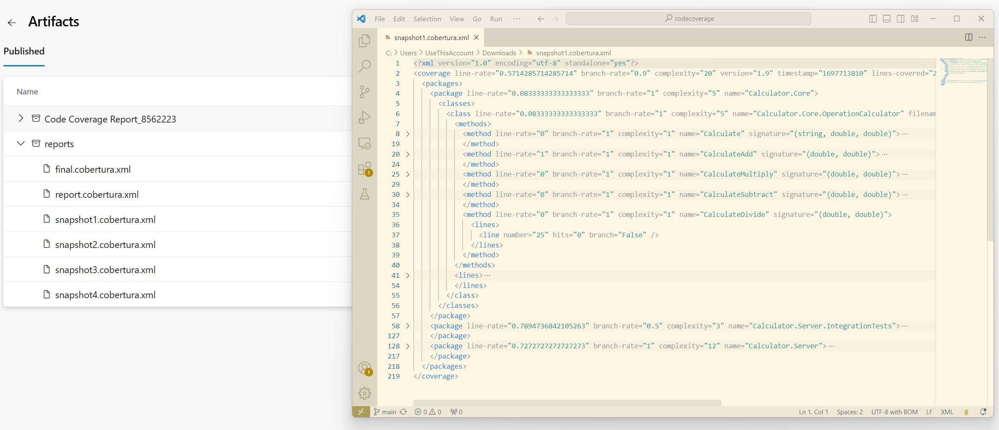

# Scenario Description

Collect code coverage for ASP.NET Core integration tests and take snapshots for each test. You can find here example how to collect coverage for server and tests if they are running in separate processes and server is started before tests execution. We generate code coverage report for each test separately using `dotnet-coverage` tool (`snapshot` command). Each snapshot operation resets all coverage data. At the end all snapshots are merged into final coverage report.

## Collect code coverage using command line

```shell
git clone https://github.com/microsoft/codecoverage.git
cd codecoverage/samples/Calculator
dotnet build
dotnet tool install -g dotnet-coverage
cd src/Calculator.Server
dotnet-coverage collect --output-format cobertura --output ../../final.cobertura.xml --session-id TagScenario16 "dotnet run --no-build" &
cd ../../tests/Calculator.Server.IntegrationTests
dotnet-coverage connect TagScenario16 "dotnet test --no-build --filter add"
dotnet-coverage snapshot --reset --output ../../snapshot1.cobertura.xml TagScenario16
dotnet-coverage connect TagScenario16 "dotnet test --no-build --filter multiply"
dotnet-coverage snapshot --reset --output ../../snapshot2.cobertura.xml TagScenario16
dotnet-coverage connect TagScenario16 "dotnet test --no-build --filter subtract"
dotnet-coverage snapshot --reset --output ../../snapshot3.cobertura.xml TagScenario16
dotnet-coverage connect TagScenario16 "dotnet test --no-build --filter divide"
dotnet-coverage snapshot --reset --output ../../snapshot4.cobertura.xml TagScenario16
dotnet-coverage shutdown TagScenario16
cd ../../
dotnet-coverage merge --output-format cobertura --output report.cobertura.xml *.cobertura.xml
```

You can also use [run.ps1](run.ps1) to collect code coverage.

## Collect code coverage inside github workflow

`reportgenerator` can be used to generate final github summary markdown.

```yml
    steps:
    - uses: actions/checkout@v3
    - name: Setup .NET
      uses: actions/setup-dotnet@v4
      with:
        dotnet-version: 8.0.x
    - name: Restore dependencies
      run: dotnet restore
    - name: Build
      run: dotnet build --no-restore
    - name: Install dotnet-coverage
      run: dotnet tool install -g dotnet-coverage
    - name: Start server
      run: dotnet-coverage collect --output-format cobertura --output $GITHUB_WORKSPACE/coverage/final.cobertura.xml --session-id TagScenario16 "dotnet run --no-build" &
      working-directory: ./samples/Calculator/src/Calculator.Server
    - name: Run test "add"
      run: dotnet-coverage connect TagScenario16 "dotnet test --no-build --filter add"
      working-directory: ./samples/Calculator/tests/Calculator.Server.IntegrationTests
    - name: Take snapshot 1
      run: dotnet-coverage snapshot --reset --output $GITHUB_WORKSPACE/coverage/snapshot1.cobertura.xml TagScenario16
    - name: Run test "multiply"
      run: dotnet-coverage connect TagScenario16 "dotnet test --no-build --filter multiply"
      working-directory: ./samples/Calculator/tests/Calculator.Server.IntegrationTests
    - name: Take snapshot 2
      run: dotnet-coverage snapshot --reset --output $GITHUB_WORKSPACE/coverage/snapshot2.cobertura.xml TagScenario16
    - name: Run test "subtract"
      run: dotnet-coverage connect TagScenario16 "dotnet test --no-build --filter subtract"
      working-directory: ./samples/Calculator/tests/Calculator.Server.IntegrationTests
    - name: Take snapshot 3
      run: dotnet-coverage snapshot --reset --output $GITHUB_WORKSPACE/coverage/snapshot3.cobertura.xml TagScenario16
    - name: Run test "divide"
      run: dotnet-coverage connect TagScenario16 "dotnet test --no-build --filter divide"
      working-directory: ./samples/Calculator/tests/Calculator.Server.IntegrationTests
    - name: Take snapshot 4
      run: dotnet-coverage snapshot --reset --output $GITHUB_WORKSPACE/coverage/snapshot4.cobertura.xml TagScenario16
    - name: Stop server
      run: dotnet-coverage shutdown TagScenario16
    - name: Merge coverage reports
      run: dotnet-coverage merge -f cobertura -o report.cobertura.xml **/snapshot*.cobertura.xml
      working-directory: '${{ github.workspace }}/coverage'
    - name: ReportGenerator
      uses: danielpalme/ReportGenerator-GitHub-Action@5.2.0
      with:
        reports: '${{ github.workspace }}/coverage/report.cobertura.xml'
        targetdir: '${{ github.workspace }}/coveragereport'
        reporttypes: 'MarkdownSummaryGithub'
    - name: Upload coverage into summary
      run: cat $GITHUB_WORKSPACE/coveragereport/SummaryGithub.md >> $GITHUB_STEP_SUMMARY
    - name: Archive code coverage results
      uses: actions/upload-artifact@v4
      with:
        name: code-coverage-report
        path: '${{ github.workspace }}/coverage'
        overwrite: true
```

[Full source example](../../../../.github/workflows/Calculator_Scenario16.yml)

[Run example](../../../../../../actions/workflows/Calculator_Scenario16.yml)

## Collect code coverage inside Azure DevOps Pipelines

```yml
steps:
- task: DotNetCoreCLI@2
  inputs:
    command: 'restore'
    projects: '$(projectPath)' # this is specific to example - in most cases not needed
  displayName: 'dotnet restore'

- task: DotNetCoreCLI@2
  inputs:
    command: 'restore'
    projects: '$(testProjectPath)' # this is specific to example - in most cases not needed
  displayName: 'dotnet restore (tests)'

- task: DotNetCoreCLI@2
  inputs:
    command: 'build'
    arguments: '--no-restore --configuration $(buildConfiguration)'
    projects: '$(projectPath)' # this is specific to example - in most cases not needed
  displayName: 'dotnet build'

- task: DotNetCoreCLI@2
  inputs:
    command: 'build'
    arguments: '--no-restore --configuration $(buildConfiguration)'
    projects: '$(testProjectPath)' # this is specific to example - in most cases not needed
  displayName: 'dotnet build (tests)'

- task: DotNetCoreCLI@2
  inputs:
    command: 'custom'
    custom: "tool"
    arguments: 'install -g dotnet-coverage'
  displayName: 'install dotnet-coverage'

- task: Bash@3
  inputs:
    targetType: 'inline'
    script: 'dotnet-coverage collect --output-format cobertura --output $(Agent.TempDirectory)/reports/final.cobertura.xml --session-id TagScenario16 "dotnet run --project $(projectPath) --no-build" &'
  displayName: 'start server under coverage'

- task: Bash@3
  inputs:
    targetType: 'inline'
    script: 'dotnet-coverage connect TagScenario16 "dotnet test --configuration $(buildConfiguration) --filter add --no-build --logger trx --results-directory $(Agent.TempDirectory)"'
    workingDirectory: '$(Build.SourcesDirectory)/samples/Calculator/tests/Calculator.Server.IntegrationTests/'
  displayName: 'execute add integration tests'

- task: Bash@3
  inputs:
    targetType: 'inline'
    script: 'dotnet-coverage snapshot --reset --output $(Agent.TempDirectory)/reports/snapshot1.cobertura.xml TagScenario16'
  displayName: 'take snapshot 1'

- task: Bash@3
  inputs:
    targetType: 'inline'
    script: 'dotnet-coverage connect TagScenario16 "dotnet test --configuration $(buildConfiguration) --filter multiply --no-build --logger trx --results-directory $(Agent.TempDirectory)"'
    workingDirectory: '$(Build.SourcesDirectory)/samples/Calculator/tests/Calculator.Server.IntegrationTests/'
  displayName: 'execute multiply integration tests'

- task: Bash@3
  inputs:
    targetType: 'inline'
    script: 'dotnet-coverage snapshot --reset --output $(Agent.TempDirectory)/reports/snapshot2.cobertura.xml TagScenario16'
  displayName: 'take snapshot 2'

- task: Bash@3
  inputs:
    targetType: 'inline'
    script: 'dotnet-coverage connect TagScenario16 "dotnet test --configuration $(buildConfiguration) --filter subtract --no-build --logger trx --results-directory $(Agent.TempDirectory)"'
    workingDirectory: '$(Build.SourcesDirectory)/samples/Calculator/tests/Calculator.Server.IntegrationTests/'
  displayName: 'execute subtract integration tests'

- task: Bash@3
  inputs:
    targetType: 'inline'
    script: 'dotnet-coverage snapshot --reset --output $(Agent.TempDirectory)/reports/snapshot3.cobertura.xml TagScenario16'
  displayName: 'take snapshot 3'

- task: Bash@3
  inputs:
    targetType: 'inline'
    script: 'dotnet-coverage connect TagScenario16 "dotnet test --configuration $(buildConfiguration) --filter divide --no-build --logger trx --results-directory $(Agent.TempDirectory)"'
    workingDirectory: '$(Build.SourcesDirectory)/samples/Calculator/tests/Calculator.Server.IntegrationTests/'
  displayName: 'execute divide integration tests'

- task: Bash@3
  inputs:
    targetType: 'inline'
    script: 'dotnet-coverage snapshot --reset --output $(Agent.TempDirectory)/reports/snapshot4.cobertura.xml TagScenario16'
  displayName: 'take snapshot 4'

- task: Bash@3
  inputs:
    targetType: 'inline'
    script: 'dotnet-coverage shutdown TagScenario16'
  displayName: 'stop code coverage collection'

- task: Bash@3
  inputs:
    targetType: 'inline'
    script: 'dotnet-coverage merge --output-format cobertura --output report.cobertura.xml *.cobertura.xml'
    workingDirectory: '$(Agent.TempDirectory)/reports/'
  displayName: 'merge coverage results'

- task: PublishTestResults@2
  inputs:
    testResultsFormat: 'VSTest'
    testResultsFiles: '$(Agent.TempDirectory)/**/*.trx'
    publishRunAttachments: false

- task: PublishCodeCoverageResults@2
  inputs:
    summaryFileLocation: $(Agent.TempDirectory)/reports/report.cobertura.xml

- publish: $(Agent.TempDirectory)/reports
  artifact: reports
```

[Full source example](azure-pipelines.yml)



## Report examples


[report](example.report.cobertura.xml)
[snapshot1](example.snapshot1.cobertura.xml)
[snapshot2](example.snapshot2.cobertura.xml)
[snapshot3](example.snapshot3.cobertura.xml)
[snapshot4](example.snapshot4.cobertura.xml)
