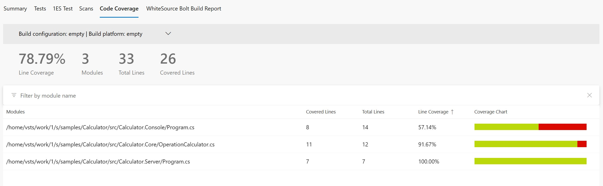
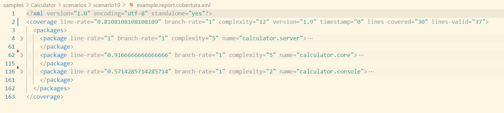

# Scenario Description

Collect code coverage for whole solution. Runsettings are configured to exclude tests projects from coverage report. You can find here example how to collect coverage for server and tests if they are running in separate processes and server is started before tests execution. `dotnet-coverage` tool is used to collect code coverage for server. At the end code coverage results for server and tests are merged. Default format is binary (`.coverage` extension) which can be opened in Visual Studio Enterprise. In pipelines during merging final coverage report is converted into cobertura format and published.

# Configuration

```xml
<?xml version="1.0" encoding="utf-8"?>
<RunSettings>
  <DataCollectionRunSettings>
    <DataCollectors>
      <DataCollector friendlyName="Code Coverage" uri="datacollector://Microsoft/CodeCoverage/2.0" assemblyQualifiedName="Microsoft.VisualStudio.Coverage.DynamicCoverageDataCollector, Microsoft.VisualStudio.TraceCollector, Version=11.0.0.0, Culture=neutral, PublicKeyToken=b03f5f7f11d50a3a">
        <Configuration>
          <CodeCoverage>
            <ModulePaths>
              <Include>
                <ModulePath>.*calculator\.[^/\\]+\.(dll|exe)$</ModulePath>
              </Include>
              <Exclude>
                <ModulePath>.*tests.dll$</ModulePath>
              </Exclude>
            </ModulePaths>
            <UseVerifiableInstrumentation>False</UseVerifiableInstrumentation>
            <EnableStaticNativeInstrumentation>False</EnableStaticNativeInstrumentation>
            <EnableDynamicNativeInstrumentation>False</EnableDynamicNativeInstrumentation>
          </CodeCoverage>
        </Configuration>
      </DataCollector>
    </DataCollectors>
  </DataCollectionRunSettings>
</RunSettings>

```

> **_NOTE:_** Remember that any regex used for `<ModulePath>` or `<Source>` is matched for file path not file name.

# Collect code coverage using command line

```shell
git clone https://github.com/microsoft/codecoverage.git
cd codecoverage/samples/Calculator
dotnet build
dotnet tool install -g dotnet-coverage
cd src/Calculator.Server
dotnet-coverage collect --output report.coverage --session-id TagScenario19 "dotnet run --no-build" &
cd ../../
dotnet test --no-build --settings ./scenarios/scenario19/coverage.runsettings "Code Coverage" --results-directory "./TestResults/"
dotnet-coverage shutdown TagScenario19
dotnet-coverage merge --output merged.coverage "./TestResults/**/*.coverage" ./src/Calculator.Server/report.coverage
```

You can also use [run.ps1](run.ps1) to collect code coverage.

# Collect code coverage inside github workflow

To generate summary report `.coverage` report needs to be converted to `cobertura` report using `dotnet-coverage` tool. Then `reportgenerator` can be used to generate final github summary markdown.

```yml
    steps:
    - uses: actions/checkout@v3
    - name: Setup .NET
      uses: actions/setup-dotnet@v3
      with:
        dotnet-version: 8.0.x
    - name: Restore dependencies
      run: dotnet restore
    - name: Build
      run: dotnet build --no-restore
    - name: Install dotnet-coverage
      run: dotnet tool install -g dotnet-coverage
    - name: Start server
      run: dotnet-coverage collect --output report.coverage --session-id TagScenario19 "dotnet run --no-build" &
      working-directory: ./samples/Calculator/src/Calculator.Server
    - name: Run tests
      run: dotnet test --settings ./scenarios/scenario19/coverage.runsettings --no-build --verbosity normal --results-directory ./TestResults/
      working-directory: ./samples/Calculator
    - name: Stop server
      run: dotnet-coverage shutdown TagScenario19
    - name: Merge coverage reports
      run: dotnet-coverage merge -f cobertura -o $GITHUB_WORKSPACE/report.cobertura.xml "./TestResults/**/*.coverage" src/Calculator.Server/report.coverage
      working-directory: ./samples/Calculator
    - name: ReportGenerator
      uses: danielpalme/ReportGenerator-GitHub-Action@5.2.0
      with:
        reports: '${{ github.workspace }}/report.cobertura.xml'
        targetdir: '${{ github.workspace }}/coveragereport'
        reporttypes: 'MarkdownSummaryGithub'
    - name: Upload coverage into summary
      run: cat $GITHUB_WORKSPACE/coveragereport/SummaryGithub.md >> $GITHUB_STEP_SUMMARY
    - name: Archive code coverage results
      uses: actions/upload-artifact@v3
      with:
        name: code-coverage-report
        path: '${{ github.workspace }}/report.cobertura.xml'
```

[Full source example](../../../../.github/workflows/Calculator_Scenario19.yml)

[Run example](../../../../../../actions/workflows/Calculator_Scenario19.yml)

# Collect code coverage inside Azure DevOps Pipelines

```yml
steps:
- task: DotNetCoreCLI@2
  inputs:
    command: 'restore'
    projects: '$(solutionPath)' # this is specific to example - in most cases not needed
  displayName: 'dotnet restore'

- task: DotNetCoreCLI@2
  inputs:
    command: 'build'
    arguments: '--no-restore --configuration $(buildConfiguration)'
    projects: '$(solutionPath)' # this is specific to example - in most cases not needed
  displayName: 'dotnet build'

- task: DotNetCoreCLI@2
  inputs:
    command: 'custom'
    custom: "tool"
    arguments: 'install -g dotnet-coverage'
  displayName: 'install dotnet-coverage'

- task: Bash@3
  inputs:
    targetType: 'inline'
    script: 'dotnet-coverage collect --output $(Agent.TempDirectory)/server.coverage --session-id TagScenario19 "dotnet run --project $(projectPath) --no-build" &'
  displayName: 'start server under coverage'

- task: DotNetCoreCLI@2
  inputs:
    command: 'test'
    arguments: '--no-build --configuration $(buildConfiguration) --settings samples/Calculator/scenarios/scenario19/coverage.runsettings --logger trx --results-directory $(Agent.TempDirectory)'
    publishTestResults: false
    projects: '$(solutionPath)' # this is specific to example - in most cases not needed
  displayName: 'execute tests'

- task: Bash@3
  inputs:
    targetType: 'inline'
    script: 'dotnet-coverage shutdown TagScenario19'
  displayName: 'stop server'

- task: Bash@3
  inputs:
    targetType: 'inline'
    script: 'dotnet-coverage merge -f cobertura -o merged.cobertura.xml "**/*.coverage"'
    workingDirectory: "$(Agent.TempDirectory)"
  displayName: 'merge coverage results'

- task: PublishTestResults@2
  inputs:
    testResultsFormat: 'VSTest'
    testResultsFiles: '$(Agent.TempDirectory)/**/*.trx'
    publishRunAttachments: false

- task: PublishCodeCoverageResults@2
  inputs:
    summaryFileLocation: $(Agent.TempDirectory)/merged.cobertura.xml
```

> **_NOTE:_** To make sure that Code Coverage tab will be visible in Azure DevOps you need to make sure that previous steps will not publish test attachments (`publishRunAttachments: false` and `publishTestResults: false`).

[Full source example](azure-pipelines.yml)



# Report example



[Link](example.report.cobertura.xml)