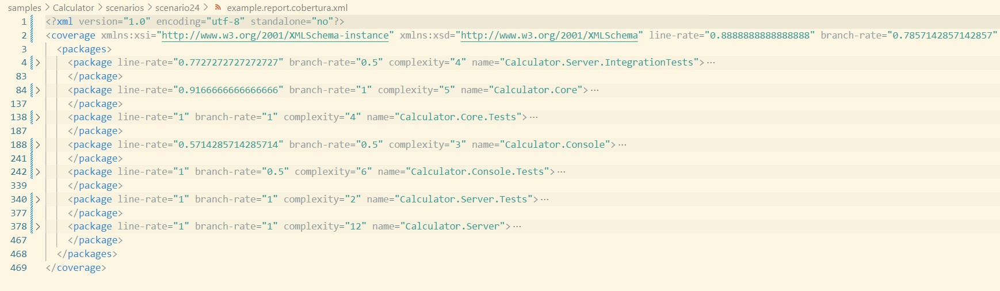

# Scenario Description

Collect code coverage for whole solution. You can find here example how to collect coverage for all unit tests. All coverage reports, from all test projects are automatically merged. To simplify integration tests are skipped because server is not started.

# Collect code coverage using command line

```shell
git clone https://github.com/microsoft/codecoverage.git
cd codecoverage/samples/Calculator
dotnet build
dotnet test --no-build --collect "Code Coverage"
```

You can also use [run.ps1](run.ps1) to collect code coverage.

# Collect code coverage inside github workflow

Executing tests is automatically creating `cobertura` report. Then `reportgenerator` can be used to generate final github summary markdown.

```yml
    steps:
    - uses: actions/checkout@v3
    - name: Setup .NET
      uses: actions/setup-dotnet@v3
      with:
        dotnet-version: 7.0.x
    - name: Restore dependencies
      run: dotnet restore
    - name: Build
      run: dotnet build --no-restore
    - name: Run tests
      run: dotnet test --collect "Code Coverage;Format=Cobertura" --no-build --verbosity normal --results-directory ./TestResults/
      working-directory: ./samples/Calculator
    - name: ReportGenerator
      uses: danielpalme/ReportGenerator-GitHub-Action@5.1.26
      with:
        reports: '${{ github.workspace }}/samples/Calculator/TestResults/**/*.cobertura.xml'
        targetdir: '${{ github.workspace }}/coveragereport'
        reporttypes: 'MarkdownSummaryGithub'
    - name: Upload coverage into summary
      run: cat $GITHUB_WORKSPACE/coveragereport/SummaryGithub.md >> $GITHUB_STEP_SUMMARY
    - name: Archive code coverage results
      uses: actions/upload-artifact@v3
      with:
        name: code-coverage-report
        path: '${{ github.workspace }}/report.cobertura.xml'
```

[Full source example](../../../../.github/workflows/Calculator_Scenario24.yml)

[Run example](../../../../../../actions/workflows/Calculator_Scenario24.yml)

# Collect code coverage inside Azure DevOps Pipelines

```yml
steps:
- task: DotNetCoreCLI@2
  inputs:
    command: 'restore'
    projects: '$(solutionPath)' # this is specific to example - in most cases not needed
  displayName: 'dotnet restore'

- task: DotNetCoreCLI@2
  inputs:
    command: 'build'
    arguments: '--no-restore --configuration $(buildConfiguration)'
    projects: '$(solutionPath)' # this is specific to example - in most cases not needed
  displayName: 'dotnet build'

- task: DotNetCoreCLI@2
  inputs:
    command: 'test'
    arguments: '--no-build --configuration $(buildConfiguration) --collect "Code Coverage"'
    projects: '$(solutionPath)' # this is specific to example - in most cases not needed
  displayName: 'execute tests'
```

> **_NOTE:_** Azure DevOps pipelines automatically recognize binary coverage report format. Code coverage results are automatically processed and published to Azure DevOps. No additional steps needed.

[Full source example](azure-pipelines.yml)


# Report example



[Link](example.report.cobertura.xml)