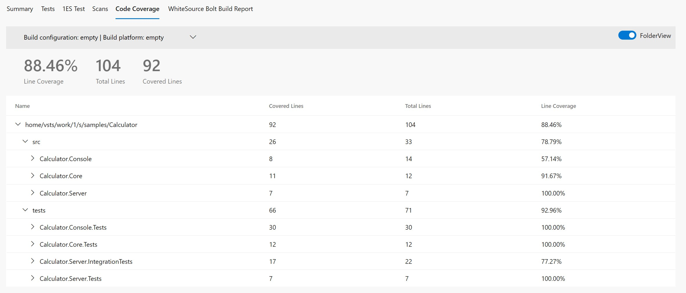
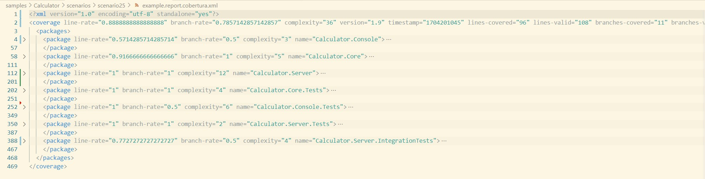

# Scenario Description

Gather code coverage for the entire solution using dotnet-coverage tool. Refer to the provided example for collecting coverage across all unit tests. The system automatically consolidates coverage reports from all test projects. Integration tests are excluded for simplification, as the server is not initiated during this process.

## Collect code coverage using command line

```shell
git clone https://github.com/microsoft/codecoverage.git
cd codecoverage/samples/Calculator
dotnet build
dotnet tool install -g dotnet-coverage
dotnet-coverage collect -f cobertura -o report.cobertura.xml "dotnet test --no-build"
```

You can also use [run.ps1](run.ps1) to collect code coverage.

## Collect code coverage inside github workflow

Executing tests is automatically creating `cobertura` report. Then `reportgenerator` can be used to generate final github summary markdown.

```yml
    steps:
    - uses: actions/checkout@v3
    - name: Setup .NET
      uses: actions/setup-dotnet@v3
      with:
        dotnet-version: 8.0.x
    - name: Install dotnet-coverage
      run: dotnet tool install -g dotnet-coverage
    - name: Restore dependencies
      run: dotnet restore
    - name: Build
      run: dotnet build --no-restore
    - name: Run tests
      run: dotnet-coverage collect --output-format cobertura --output ./TestResults/report.cobertura.xml "dotnet test --no-build"
    - name: ReportGenerator
      uses: danielpalme/ReportGenerator-GitHub-Action@5.2.0
      with:
        reports: '${{ github.workspace }}/samples/Calculator/TestResults/**/*.cobertura.xml'
        targetdir: '${{ github.workspace }}/coveragereport'
        reporttypes: 'MarkdownSummaryGithub'
    - name: Upload coverage into summary
      run: cat $GITHUB_WORKSPACE/coveragereport/SummaryGithub.md >> $GITHUB_STEP_SUMMARY
    - name: Archive code coverage results
      uses: actions/upload-artifact@v4
      with:
        name: code-coverage-report
        path: '${{ github.workspace }}/samples/Calculator/TestResults/**/*.cobertura.xml'
        overwrite: true
```

[Full source example](../../../../.github/workflows/Calculator_Scenario25.yml)

[Run example](../../../../../../actions/workflows/Calculator_Scenario25.yml)

## Collect code coverage inside Azure DevOps Pipelines

```yml
steps:
- task: DotNetCoreCLI@2
  inputs:
    command: 'custom'
    custom: "tool"
    arguments: 'install -g dotnet-coverage'
  displayName: 'install dotnet-coverage'

- task: DotNetCoreCLI@2
  inputs:
    command: 'restore'
    projects: '$(solutionPath)' # this is specific to example - in most cases not needed
  displayName: 'dotnet restore'

- task: DotNetCoreCLI@2
  inputs:
    command: 'build'
    arguments: '--no-restore --configuration $(buildConfiguration)'
    projects: '$(solutionPath)' # this is specific to example - in most cases not needed
  displayName: 'dotnet build'

- task: Bash@3
  inputs:
    targetType: 'inline'
    script: 'dotnet-coverage collect -f cobertura -o $(Agent.TempDirectory)/report.cobertura.xml "dotnet test --configuration $(buildConfiguration) --no-build --logger trx --results-directory $(Agent.TempDirectory)"'
    workingDirectory: '$(Build.SourcesDirectory)/samples/Calculator/'
  displayName: 'dotnet test'

- task: PublishTestResults@2
  inputs:
    testResultsFormat: 'VSTest'
    testResultsFiles: '$(Agent.TempDirectory)/**/*.trx'

- task: PublishCodeCoverageResults@2
  inputs:
    summaryFileLocation: $(Agent.TempDirectory)/report.cobertura.xml
```

[Full source example](azure-pipelines.yml)



## Report example



[Link](example.report.cobertura.xml)
