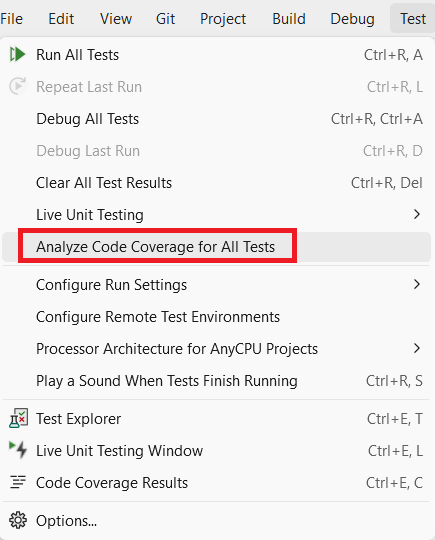
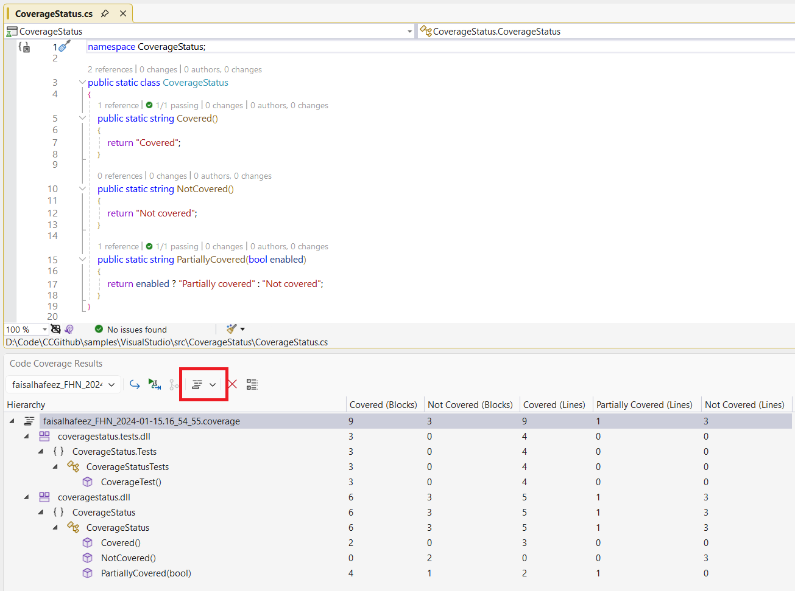
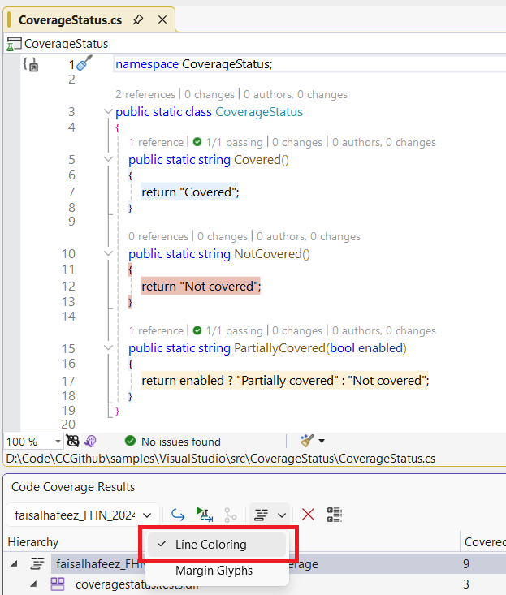
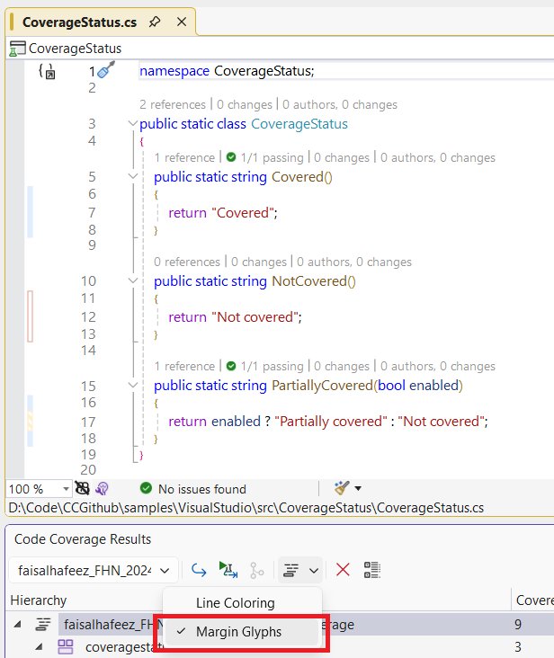
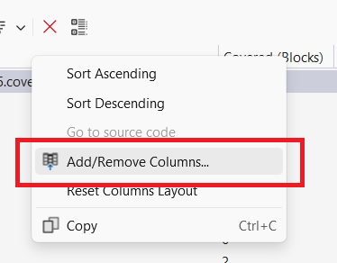
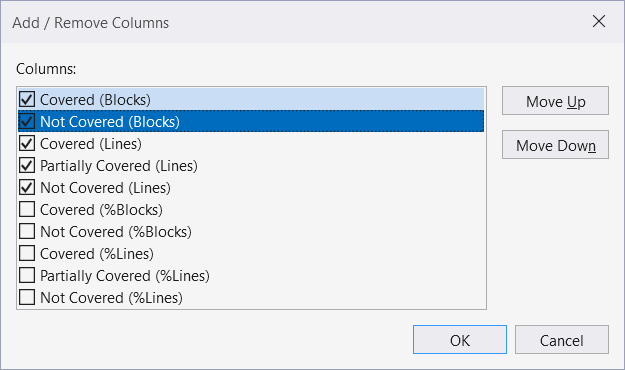

# Scenario Description

Collect and view code coverage in Microsoft Visual Studio Enterprise.

## Collect code coverage

1. Clone repository

    ```shell
    git clone https://github.com/microsoft/codecoverage.git
    ```

2. Open solution in Visual Studio Enterprise

    ```shell
    cd codecoverage/samples/VisualStudio
    start VisualStudio.sln
    ```

3. Calculate code coverage using **Analyze Code Coverage for All Tests** in the **Test** menu.

    

## Enable code coverage coloring

1. Enable code coverage coloring, choose  **Show Code Coverage Coloring** to enable coloring in the editor.

    

2. Enable **Line Coloring** to view coverage status in the code editor.

    

3. Enable **Margin Glyphs** to view coverage status in the margin editor.

    

## Update code coverage result window layout

1. Update columns using  **Add/Remove Columns...** from the context menu.

    

2. Add/remove or order columns shown in the code coverage results window.

    