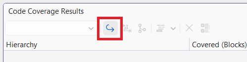
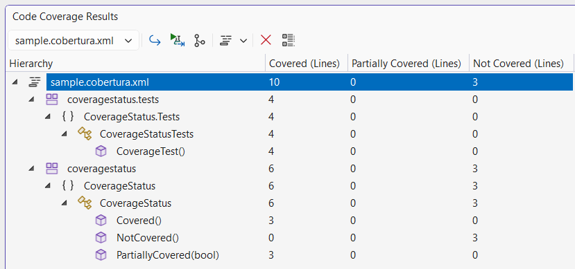

# Scenario Description

Code coverage formats supported in Microsoft Visual Studio Enterprise.

## Supported formats

Following coverage report formats can be opened in Code Coverage Results window in Microsoft Visual Studio Enterprise

- **Binary (Default):** .coverage (Microsoft's special binary format) [Sample report](../../reports/sample.coverage)

- **Cobertura:** .cobertura.xml (Open-source XML format) [Sample report](../../reports/sample.cobertura.xml)

- **XML:** .xml (Microsoft's XML Format) [Sample report](../../reports/sample.xml)

- **CoverageXml:** .coveragexml (Microsoft XML format) [Sample report](../../reports/sample.coveragexml)

## Import code coverage report

Supported formats can be opened by using **Import Results** button in the **Code Coverage Results** window toolbar.

Some report formats do not support blocks (e.g. cobertura), in that case columns related to blocks are removed automatically from the view.

- Report with blocks information

    

- Report withtout blocks information

    

## Export code coverage report

Opened coverage report can be exported to any supported format by using **Export Results** butt in the **Code Coverage Results** window toolbar.

Specify format type and export report.

