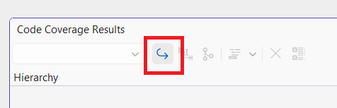
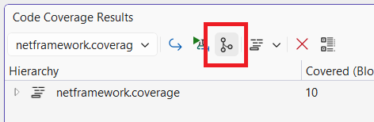
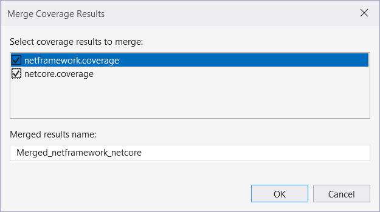
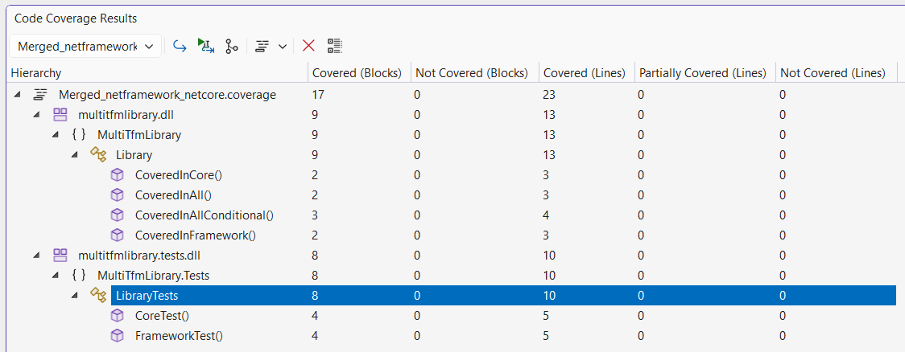
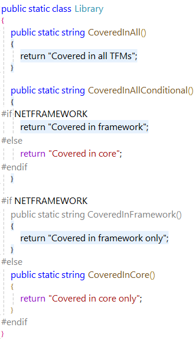
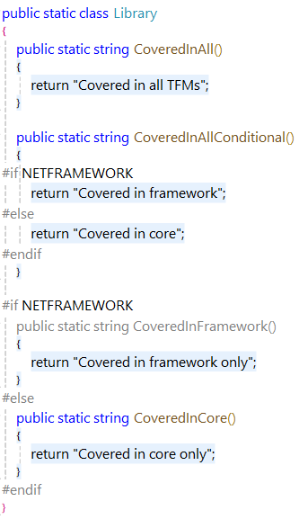

# Scenario Description

Merge reports in Microsoft Visual Studio Enterprise.

## Merge reports

1. Import reports in the window.
    - [NetFramework report](../../reports/netframework.coverage)
    - [NetCore report](../../reports/netcore.coverage)
    
    

    

2. Merge reports using **Merge Results** button in the **Code Coverage Results** window toolbar.

    

3. Select **reports** to merge in the **Merge Coverage Results** dialog.

    

4. The **Merged report** is displayed in the results window.

    

If reports contain project which are generated against same source code, then they are merged together into a single node. For example, if one report is generated against net481 and another against net8.0, then merged report contains coverage statistics covered by both target frameworks.

Framework Report | Core Report | Merged Report
--- | --- | ---
 |  | 

Different report formats can be merged as well. However, data is added or removed required for the merged report (e.g. blocks coverage is not available in cobertura report.).
