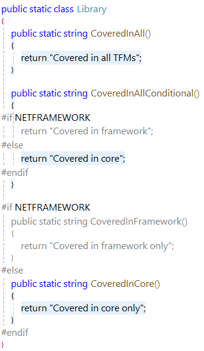

# Scenario Description

Merge reports in Microsoft Visual Studio Enterprise.

## Merge reports

1. Import reports.
    - [NetFramework report](../../reports/netframework.coverage)

    - [NetCore report](../../reports/netcore.coverage)

2. Merge reports using **Merge Results** button in the **Code Coverage Results** window toolbar.

    

3. Select reports to merge in the **Merge Coverage Results** dialog.

    

4. Merge report is added in the results window.

    

If reports are generated against same source code, then they are merged together into a single node. For example, if there are reports generated for same source code but different TFMs (e.g. net481, net8.0), then merged report will combine it together and will add missing items not available in input reports.

Framework Report | Core Report | Merged Report
--- | --- | ---
 |  | 

Different report formats can be merged as well. However, data is added or removed required for the merged report (e.g. blocks coverage is not available in cobertura report.).
