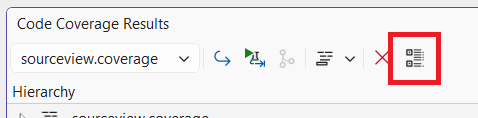
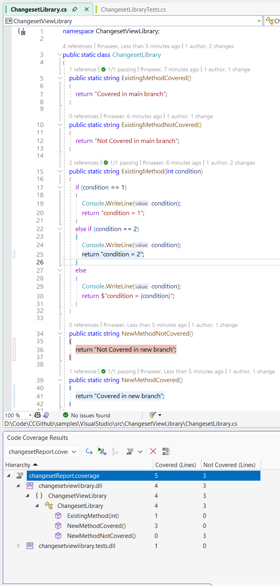

# Report Type View

Report content can be filtered in two different ways in the **Code Coverage Results** window

1. Full Report
2. Changeset Report

View can be selected by using  **Configure Code Coverage Views** button in the window toolbar.



Select report content from the **Code Coverage Views** dialog.


## Full Report

Full report shows all content present in the coverage report.

## Changeset Report

Changeset report filters coverage report and shows only statistics for the changes made in local branch. Developers can use this information to identify missing coverage for their changes and can improve coverage for newly added code.

## Example

1. Clone repository

    ```shell
    git clone https://github.com/microsoft/codecoverage.git
    ```

2. Switch branch and open solution in Visual Studio Enterprise

    ```shell
    cd codecoverage/samples/VisualStudio
    git checkout changeset-view  
    start VisualStudio.sln
    ```

3. Analyze code coverage

4. Switch to **Changeset Report** and set **Base Branch** (origin/main)
    

Full Report | Changeset Report
--- | ---
 | 

Full report shows coverage statistics for whole report, while changeset report shows coverage only for changes made in local branch (changeset-view).
