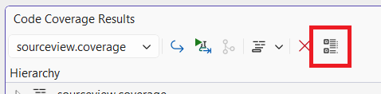
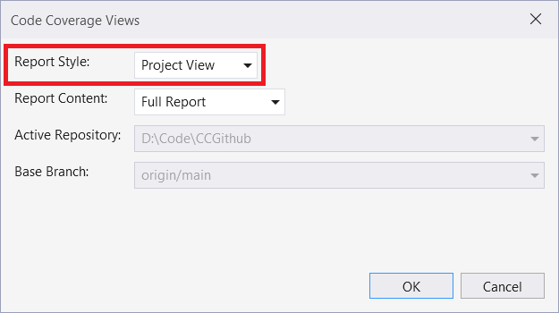
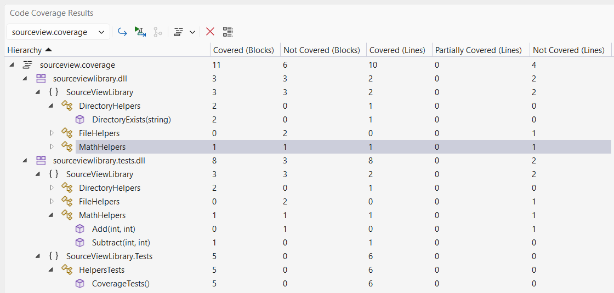
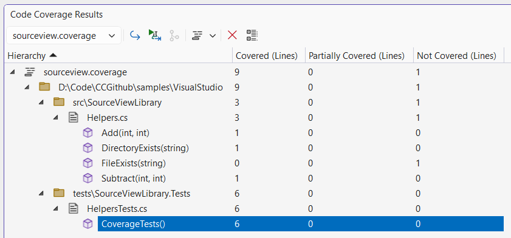

# Report Type View

Coverage report content can be visualized in two different ways in the **Code Coverage Results** window

1. Project View
2. Source View

View can be selected by using  **Configure Code Coverage Views** button in the window toolbar.

Select **Report Style** from the **Code Coverage Views** dialog.

## Project View

Project view shows coverage data in the following hierarchy

-  Report
  -  Project1
    -  Namespace1
      -  Class1
        -  Method
      -  Class2
        -  Method
        -  Method
    -  Namespace2
      -  Class3
        -  Method
  -  Project2

## Source View

Source view shows coverage data in directory/file hierarchy

-  Report
  -  Directory1
    -  Directory2
      -  File1
        -  Method
        -  Method
      -  File2
        -  Method
    -  File3
      -  Method
  -  File4
    -  Method

Source view combines coverage data available for all projects and combines them on a file level. Source view does not support blocks coverage data.

## Example

Open [sourceview.coverage](../../../reports/sourceview.coverage) in the window. **Helpers.cs** file contains **MathHelpers**, **DirectoryHelpers**, and **FileHelpers** classes and is included in **SourceViewLibrary** and **SourceViewLibrary.Tests** project.

  1. Project view shows classes in both project nodes. Coverage statistics are according to respective project.
  
  2. Source view combines coverage statistics for all classes and methods present in a file.
  
