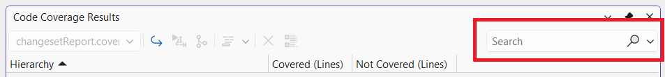
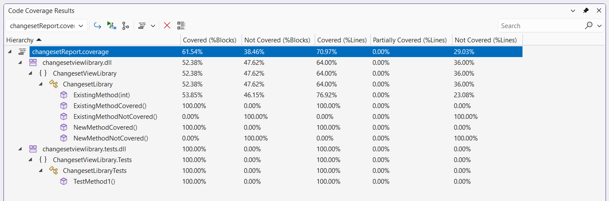
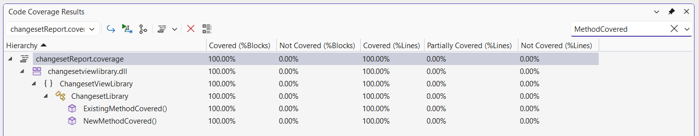
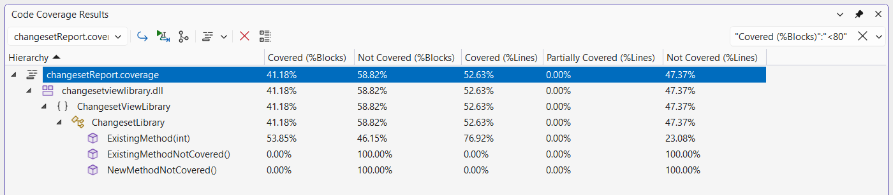
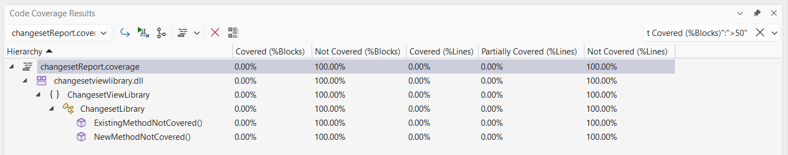
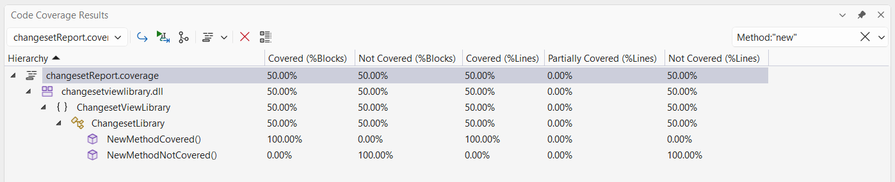
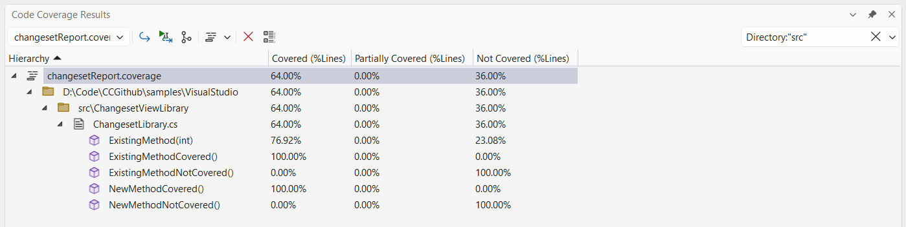

# Scenario Description

Search code coverage content in Microsoft Visual Studio Enterprise.

## Search

Search parameters can be used to filter the coverage report.

Search parameters are provided in the search control in the window toolbar.

## Search Parameters

Following search parameters are available to filter the coverage report

1. Coverage numbers - methods where coverage value is greater or smaller than the specified search query
    1. Covered (%Blocks)
    2. Not Covered (%Blocks)
    3. Covered (%Lines)
    4. Partially Covered (%Lines)
    5. Not Covered (%Lines)
1. Name - items that contain input search query in their name
    1. Project Report
        1. Name
        2. Project
        3. Namespace
        4. Class
        5. Method
    2. Source Report
        1. Name
        2. Directory
        3. File
        4. Method

## Examples

- Without any search parameters

  

- Name search
  
  

- "Covered (%Blocks)":"<80"

  

- "Not Covered (%Blocks)":">50"

  

- Method:"new"
  

- Directory:"src"
  
