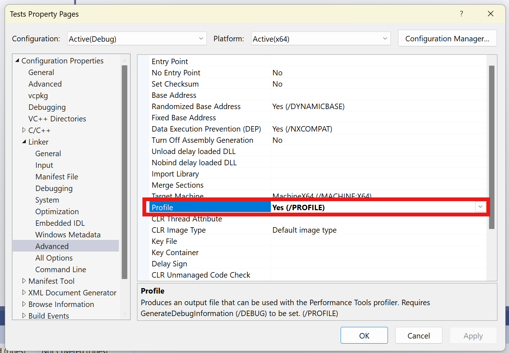
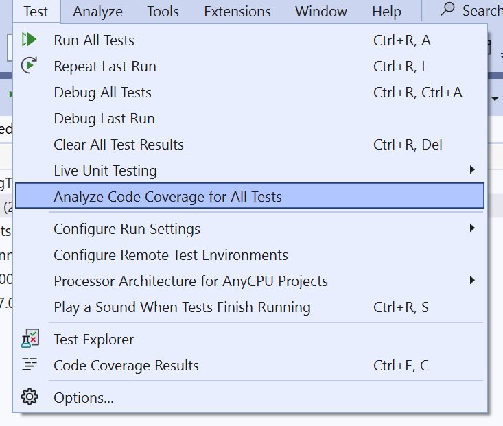
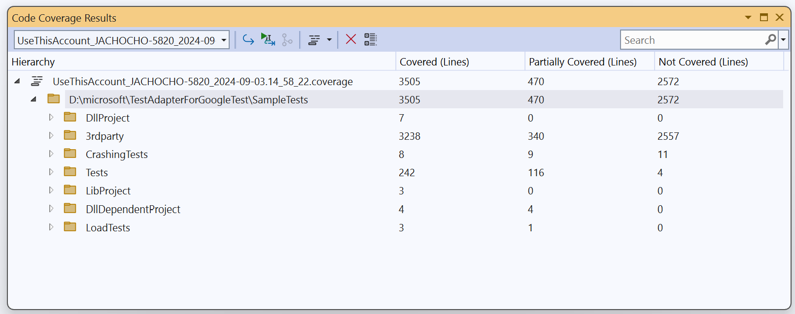

# Scenario Description

Static C++ code coverage for [google test adapter](https://github.com/microsoft/TestAdapterForGoogleTest) samples tests in Visual Studio.

## Collect C++ code coverage

1. Clone [google test adapter](https://github.com/microsoft/TestAdapterForGoogleTest) repository

    ```shell
    git clone https://github.com/microsoft/TestAdapterForGoogleTest.git
    ```

2. Open solution in Visual Studio Enterprise

    ```shell
    cd TestAdapterForGoogleTest/SampleTests
    start SampleTests.sln
    ```

3. Enable **Profile** (Configuration Properties->Linker->Advanced) flag for all projects in solution

    

4. Collect code coverage using **Analyze Code Coverage for All Tests** in the **Test** menu

    

5. View code coverage results

    