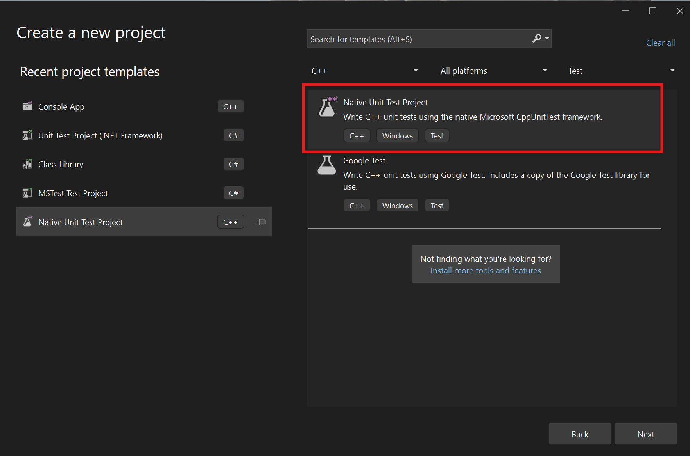
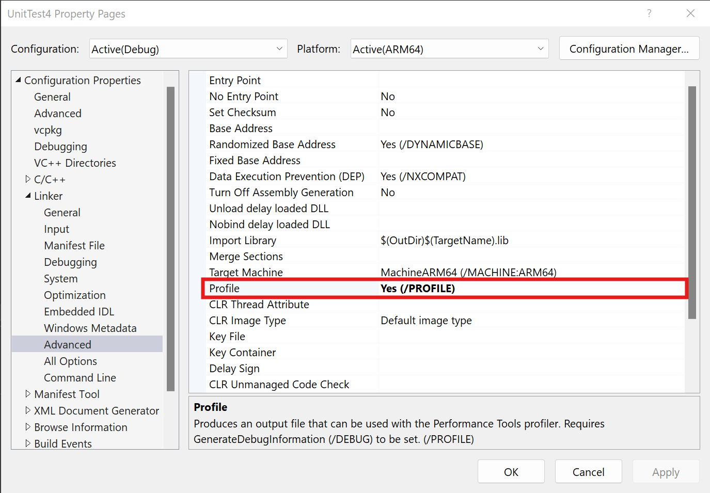
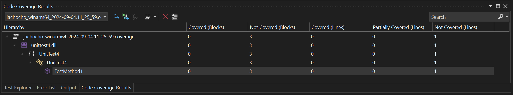

# Scenario Description

Static C++ code coverage for new Native Unit Test project in Visual Studio ARM64.

## Collect C++ code coverage on ARM64 system

1. Open Visual Studio Enterprise

2. Create new Native Unit Test project.

    

3. Enable **Profile** (Configuration Properties->Linker->Advanced) flag for all projects in solution

    

4. Collect code coverage using **Analyze Code Coverage for All Tests** in the **Test** menu

    

5. View code coverage results

    
