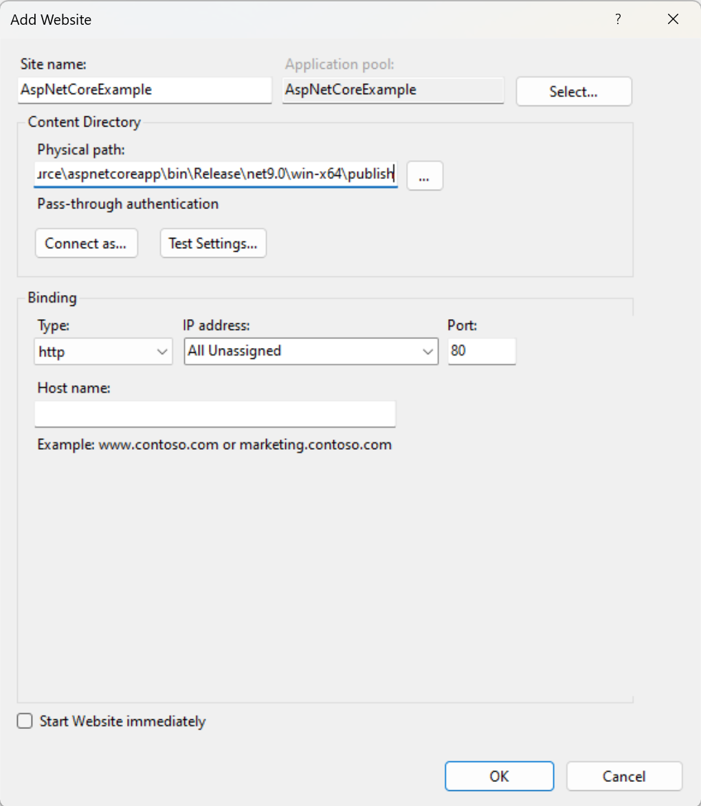
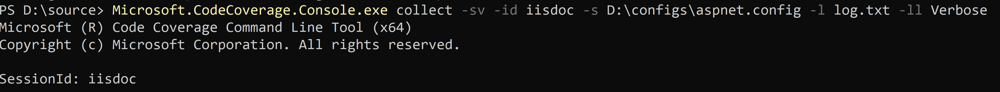
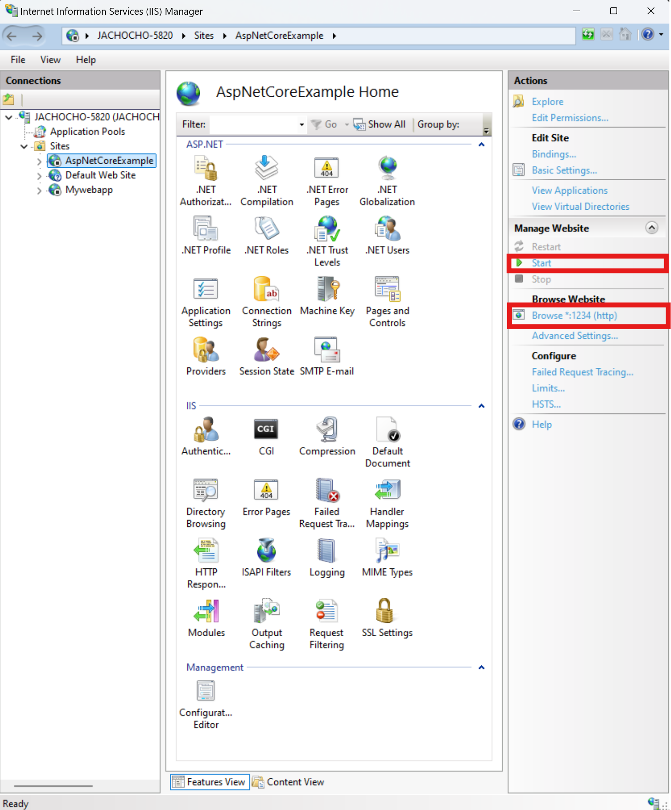
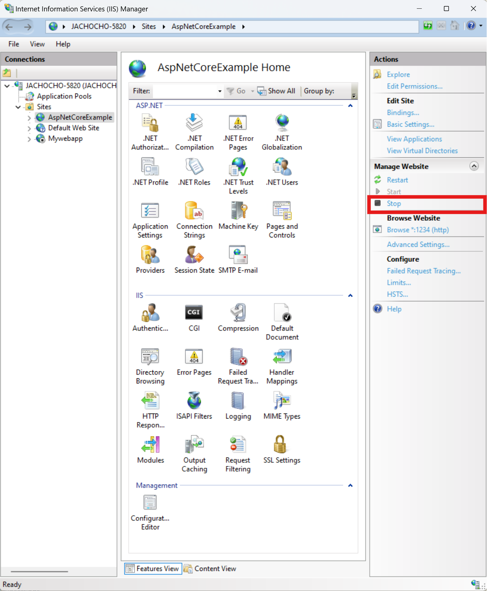
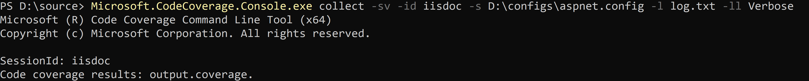
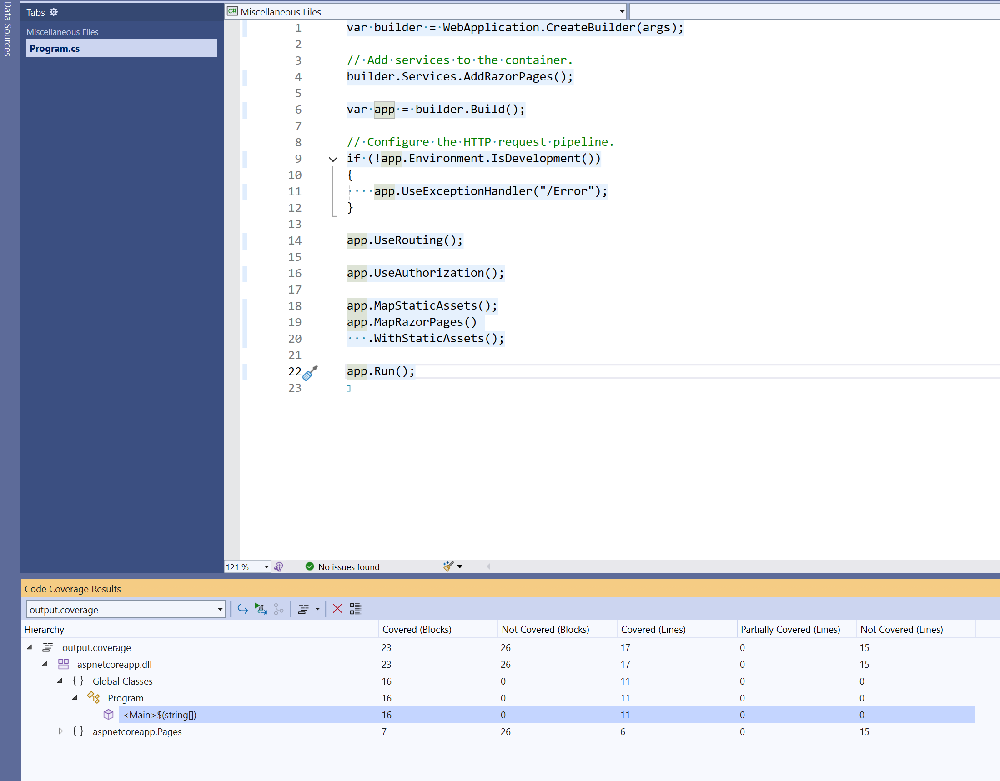

# Scenario Description

Static code coverage for ASP.NET Core Web App (Razor Pages) in IIS.

## Collect code coverage from IIS

1. Generate ASP.NET Core Web App (Razor Pages) project in console

    ```console
    dotnet new webapp --output aspnetcoreapp --no-https
    ```

     Project.")

2. Publish ASP.NET Core Web App (Razor Pages).

    ```console
    dotnet publish -r win-x64
    ```

     Project.")

3. Instrument `aspnetcoreapp.dll` in Developer PowerShell for VS Enterprise.

    ```console
    Microsoft.CodeCoverage.Console.exe instrument aspnetcoreapp.dll -id iisdoc
    ```

    ")
    > **_NOTE:_** For more complicated projects you will need to instrument more libraries.

4. Create new website in IIS Manager. Use publish directory as **Physical path**. Use `AspNetCoreExample` as site name. Do not start website yet.
    

5. Create code coverage configuration file `aspnet.config` with `AspNetCoreExample` in `AllowedUsers`.

    ```xml
    <?xml version="1.0" encoding="utf-8"?>
    <Configuration>
        <CodeCoverage>
            <AllowedUsers>
                <User>IIS APPPOOL\AspNetCoreExample</User>
            </AllowedUsers> 
        </CodeCoverage>
    </Configuration>
    ```

6. Start code coverage collection in Admin mode Developer Powershell for VS Enterprise. It is also required to have `SeCreateGlobalPrivilege` privilege to correctly pass coverage data to collector.

    ```console
    Microsoft.CodeCoverage.Console.exe collect -sv -id iisdoc -s D:\configs\aspnet.config
    ```

    

7. Start and browse website.
    

8. Stop website.
    

9. Stop code coverage collection using **Ctrl+C**.
    

10. Open `output.coverage` file in Visual Studio Enterprise.
    
