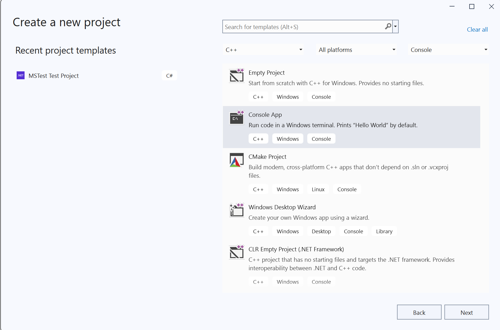
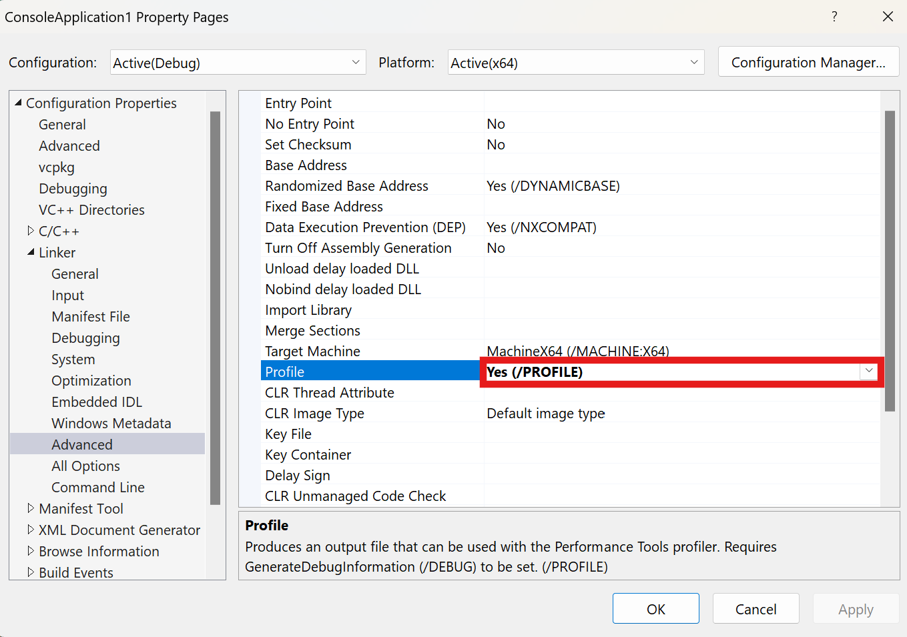
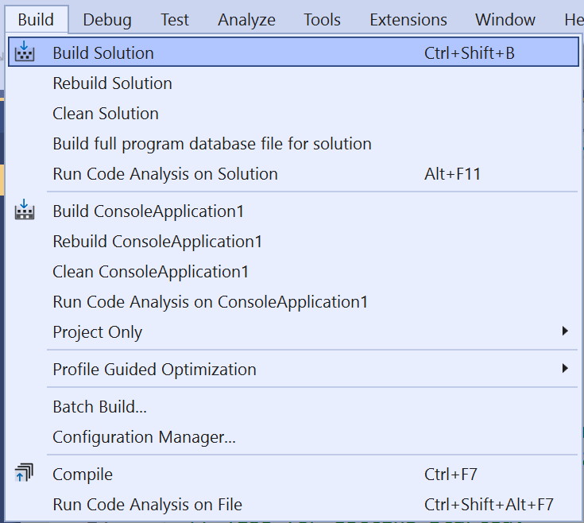
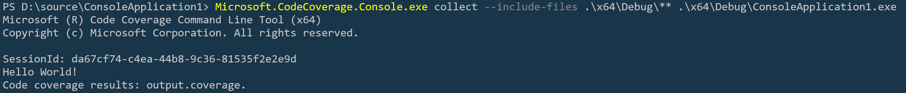
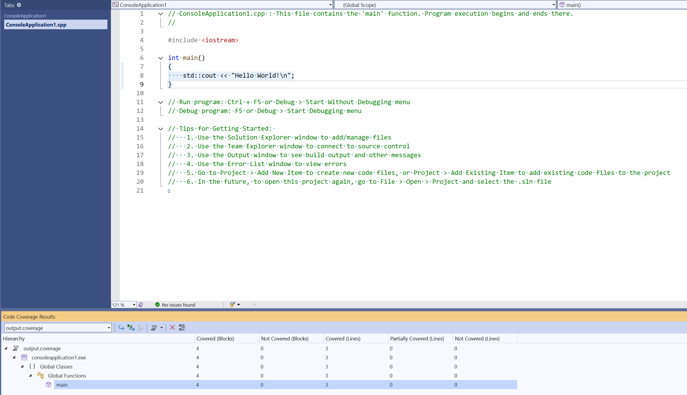

# Scenario Description

Static C++ code coverage for new Native Console App project in Visual Studio.

## Collect C++ code coverage Console App

1. Open Visual Studio Enterprise

2. Create new Native Console App project.

    

3. Enable **Profile** (Configuration Properties->Linker->Advanced) flag for all projects in solution

    

4. Build solution

    

5. Collect code coverage in Developer PowerShell for VS Enterprise
```console
Microsoft.CodeCoverage.Console.exe collect --include-files .\x64\Debug\** .\x64\Debug\ConsoleApplication1.exe
```


6. View code coverage results

    